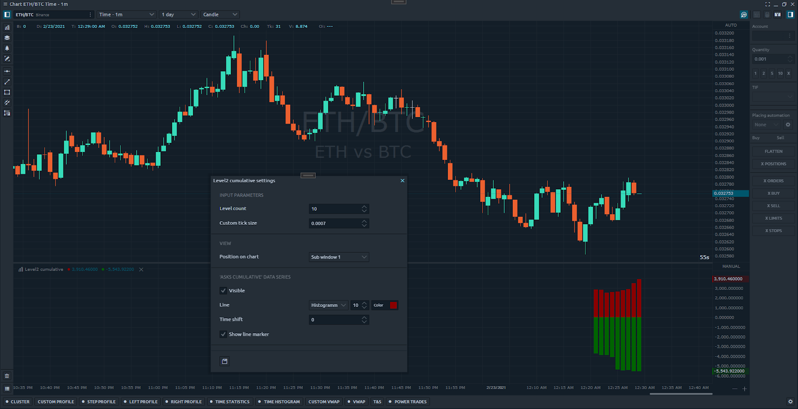

# Level2 данные

## Теория

Книга заказов \(или level2\) - это набор заявок на покупку и продажу для определенных инструментов, организованных по уровню цен. У каждого уровня есть три важных значения - цена, размер и сторона. Эта коллекция динамична, то есть постоянно обновляется в реальном времени в течение дня.

Многие профессиональные трейдеры разрабатывают свои стратегии, используя данные книги заказов. Quantower API предоставляет пользователям простой способ получить агрегированные и неагрегированные снимки книги заказов. \*\* Чтобы использовать его, вам просто нужно выполнить метод GetDepthOfMarketAggregatedCollections и передать нужные вам параметры. Этот метод находится в классе «DepthOfMarket». У каждого инструмента есть свой объект DepthOfMarket.

#### Загрузки

Есть два метода загрузки

```csharp
public DepthOfMarketAggregatedCollections GetDepthOfMarketAggregatedCollections(GetLevel2ItemsParameters parameters = null)
```

Этот метод принимает объект [GetLevel2ItemsParameters](https://api.quantower.com/docs/TradingPlatform.BusinessLayer.GetLevel2ItemsParameters.html) со свойствами:

* \*\*\*\*[**AggregatedMethod**](https://api.quantower.com/docs/TradingPlatform.BusinessLayer.AggregateMethod.html) - перечисление, тип агрегирования \(по умолчанию «Уровень цен»\)
* **CustomTickSize** - шаг агрегирования \(не может быть меньше размера тика символа\)
* **LevelsCount** - количество необходимых уровней
* **CalculateCumulative** - установите значение true, если вам нужно кумулятивное значение для каждого уровня цен.

```csharp
public DepthOfMarketAggregatedCollections GetDepthOfMarketAggregatedCollections(GetDepthOfMarketParameters parameters)
```

Этот метод принимает объект [`«GetDepthOfMarketParameters»`](https://api.quantower.com/docs/TradingPlatform.BusinessLayer.GetDepthOfMarketParameters.html) со свойствами:

* [**GetLevel2ItemsParameters**](https://api.quantower.com/docs/TradingPlatform.BusinessLayer.GetLevel2ItemsParameters.html) **-** объект, описанный выше.
* **CalculateImbalancePercent -** установите значение «истина», если вам необходимо значение «дисбаланса» для каждого уровня цен.

Эти методы возвращают объект [DepthOfMarketAggregatedCollections](https://api.quantower.com/docs/TradingPlatform.BusinessLayer.DepthOfMarketAggregatedCollections.html) с двумя списками - Asks и Bids. Каждая коллекция содержит экземпляры класса [Level2Item](https://api.quantower.com/docs/TradingPlatform.BusinessLayer.Level2Item.html). Есть наши уровни цен.

## **Практика**

В этом разделе мы разработаем простой индикатор, который будет рисовать «кумулятивные» значения в виде гистограммы.



### Входные параметры

Во-первых, давайте определим входные параметры. Мы хотим управлять количеством уровней и устанавливать собственный размер тика.

```csharp
[InputParameter("Level count", 10, 1, 9999, 1, 0)]
public int InputLevelsCount = 10;

[InputParameter("Custom tick size", 30, 0.0001, 9999, 0.0001, 4)]
public double InputCustomTicksize = 0.0001;
```

### Конструктор класса

Заполните конструктор нашего класса. Задайте имя и добавьте серию строк.

```csharp
Name = "Level2 cumulative";

AddLineSeries("Asks cumulative", Color.DarkRed, 10, LineStyle.Histogramm);
AddLineSeries("Bids cumulative", Color.DarkGreen, 10, LineStyle.Histogramm);

SeparateWindow = true;
```

### OnInit метод


Обращать внимание! В методе OnInit нам нужно подписаться на событие NewLevel2. Это необходимо для того, чтобы терминал отправил поставщику запрос подписки на «книгу заказов». Метод Symbol\_NewLevel2Handler мы оставляем пустым.


```csharp
protected override void OnInit()
{
     this.Symbol.NewLevel2 += Symbol_NewLevel2Handler;
}

private void Symbol_NewLevel2Handler(Symbol symbol, Level2Quote level2, DOMQuote dom)
{

}
```

### OnUpdate метод

В методе OnUpdate мы пропускаем историческую часть, а затем получаем снимок уровня 2. Обязательно проверьте, что коллекции Ask / Bid имеют значения. Затем мы получаем требуемые уровни и устанавливаем «Накопительные» значения в наши индикаторные буферы.

```csharp
protected override void OnUpdate(UpdateArgs args)
{
    // skip historical part
    if (args.Reason == UpdateReason.HistoricalBar)
       return;

    // get current 'order book' snapshot
    var dom = this.Symbol.DepthOfMarket.GetDepthOfMarketAggregatedCollections(new GetLevel2ItemsParameters()
    {
        AggregateMethod = AggregateMethod.ByPriceLVL,
        LevelsCount = this.InputLevelsCount,
        CalculateCumulative = true,
        CustomTickSize = this.InputCustomTicksize
    });

    if (dom.Asks.Length > 0)
       SetValue(dom.Asks.Last().Cumulative, 0);

    if (dom.Bids.Length > 0)
       SetValue(-dom.Bids.Last().Cumulative, 1);
}
```

### OnClear метод

В «OnClear» не забудьте отказаться от подписки на «NewLevel2».

```csharp
protected override void OnClear()
{
    this.Symbol.NewLevel2 -= Symbol_NewLevel2Handler;
}
```

