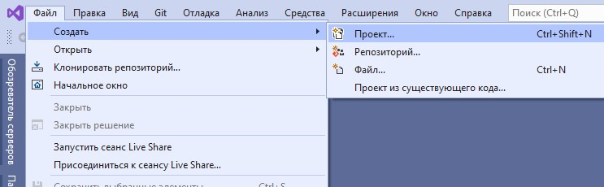

# Простой индикатор


Мы будем использовать расширение Quantower Algo для Visual Studio, но основные принципы действительны для всех сред разработки. Если у вас не установлено расширение Visual Studio или Quantower Algo, вы можете прочитать руководство [**Как установить Quantower Algo.**](https://app.gitbook.com/@quantower/s/quantower-ru/\~/drafts/-Mb\_LzyI38AnKls7m3Ia/quantower-algo/installing-visual-studio)****

Смотрите примеры некоторых стратегий, интеграций и индикаторов в нашем [**репозитории Github.**](https://github.com/Quantower/Examples)****


## Итак, что такое индикатор в целом?

Индикатор  - это математические вычисления, основанные на цене или объеме финансового инструмента. Результат используется для отображения на графике и помогает трейдеру принять правильное решение. С технической точки зрения индикатор в Quantower представляет собой набор линий с буферами. Каждому элементу буфера присваивается исторический бар или тик на графике. Все, что вам нужно, это произвести необходимые вычисления и поместить результат в этот буфер.

Звучит не очень сложно, правда? Давайте начнем! Например, напишем код, который будет реализовывать алгоритм индикатора Simple Moving Average.

Используйте _**«Файл -> Новый проект»**_ в главном меню Visual Studio, чтобы открыть окно «Новый проект». Наберите «Индикатор», и вы увидите специальный тип проекта для пустого индикатора:

Для начала нужно создать новый проект индикатора. Quantower Algo предоставляет вам предопределенные шаблоны для пустого индикатора, а также несколько примеров реальных индикаторов с исходным кодом:




Минимально необходимый исходный код будет сгенерирован автоматически и содержит основные функции индикатора:


## Структура кода индикатора

### Общие настройки

Пора углубиться в код. В методе конструктора вы можете указать имя индикатора, краткое имя для отображения на графиках и необходимость отдельного окна на графике для вашего индикатора. Наиболее важным здесь является указание количества линий и их стиля по умолчанию: Solid / Dot / Histogram, цвета и ширины. В нашем примере нам нужна всего одна строка, но вы можете добавить любую сумму:

```csharp
/// <summary>
/// Indicator's constructor. Contains general information: name, description, LineSeries etc. 
/// </summary>
public SimpleIndicator()
    : base()
{
    // Defines indicator's name and description.
    Name = "SimpleIndicator";
    Description = "My indicator's annotation";

    // Defines line on demand with particular parameters.
    AddLineSeries("line1", Color.CadetBlue, 1, LineStyle.Solid);

    // By default indicator will be applied on main window of the chart
    SeparateWindow = false;
}
```

### Получение данных

Метод «OnUpdate» будет вызываться каждый раз при изменении истории - здесь нам нужно добавить свои расчеты. Большинство индикаторов используют в своих алгоритмах цены или объемы. Quantower API предоставляет вам несколько способов получить эти данные - вы можете получить доступ к данным открытия, максимума, минимума, закрытия и других данных из текущего бара или из предыдущих столбцов, если это необходимо.

Общий метод [**GetPrice**](http://api.quantower.com/docs/TradingPlatform.BusinessLayer.Indicator.html#TradingPlatform\_BusinessLayer\_Indicator\_GetPrice\_TradingPlatform\_BusinessLayer\_PriceType\_System\_Int32\_) позволяет получить все типы данных:

```csharp
// To get Low price of the current bar
double low = GetPrice(PriceType.Low);
// To get Volume price for the fifth bar before the current
double volume = GetPrice(PriceType.Volume, 5);
```

И несколько упрощенных способов получить данные:

```csharp
// To get Close price of the current bar
double close = Close();
// To get High price of the current bar
double high = High();
// To get Open price for the fifth bar before the current
double open = Open(5);
```

Дополнительную информацию о классе **«Индикатор»** можно найти в нашей[ документации по API.](http://api.quantower.com/)

### Установка данных

Теперь мы знаем, как получать цены, но, как мы уже говорили, нам также нужно поместить результаты в индикаторный буфер. Для этого мы можем использовать метод [**SetValue**](http://api.quantower.com/docs/TradingPlatform.BusinessLayer.Indicator.html#TradingPlatform\_BusinessLayer\_Indicator\_SetValue\_System\_Double\_System\_Int32\_System\_Int32\_)**:**

```csharp
// Put value into current bar for first line of indicator
SetValue(1.43);
// Put value into current bar for second line of indicator
SetValue(1.43, 1);
// Put value into fifth bar before the current bar for second line of indicator
SetValue(1.43, 1, 5);
```

Всего этого достаточно, чтобы закончить наш первый индикатор. Добавим вычисления в метод «OnUpdate», используя стандартные возможности C #. Это наш общий код:

```csharp
/// <summary>
/// Calculation entry point. This function is called when a price data updates. 
/// </summary>
protected override void OnUpdate(UpdateArgs args)
{
    int Period = 10;

    // Checking, if current amount of bars
    // more, than period of moving average. If it is true
    // then the calculation is possible
    if (Count <= Period)
        return;

    double sum = 0.0; // Sum of prices
    for (int i = 0; i < Period; i++)
        // Adding bar's price to the sum
        sum += GetPrice(PriceType.Close, i);

    // Set value to the "SMA" line buffer.
    SetValue(sum / Period);
}
```

Как видите, для расчетов мы используем только цены закрытия и значение периода в жестком коде. В реальном случае вы позволите пользователю указать эти значения. В нашей следующей теме мы покажем, как использовать входной параметр для ваших скриптов.

### Построение

Нам нужно его скомпилировать - используйте **«Build -> Build Solution**» в главном меню или горячую клавишу F6. Расширение Quantower Algo автоматически скопирует ваш индикатор на назначенную торговую платформу Quantower, и вы увидите его в справочнике «Индикаторы» на графике:


Если вы решите внести некоторые исправления в свои расчеты, вы можете перестроить свой индикатор, и вам даже не нужно повторно добавлять его на график - он будет обновлен автоматически, и вы сразу увидите результаты:


Используя этот базовый пример, вы можете легко создать свой собственный индикатор - вам доступны все возможности языка C #. В следующем разделе мы покажем вам, как добавить возможность настройки вашего [**индикатора с помощью входных параметров.**](https://app.gitbook.com/@quantower/s/quantower-ru/\~/drafts/-Mb\_ghthoUhM1PT07NwU/quantower-algo/input-parameters)****
