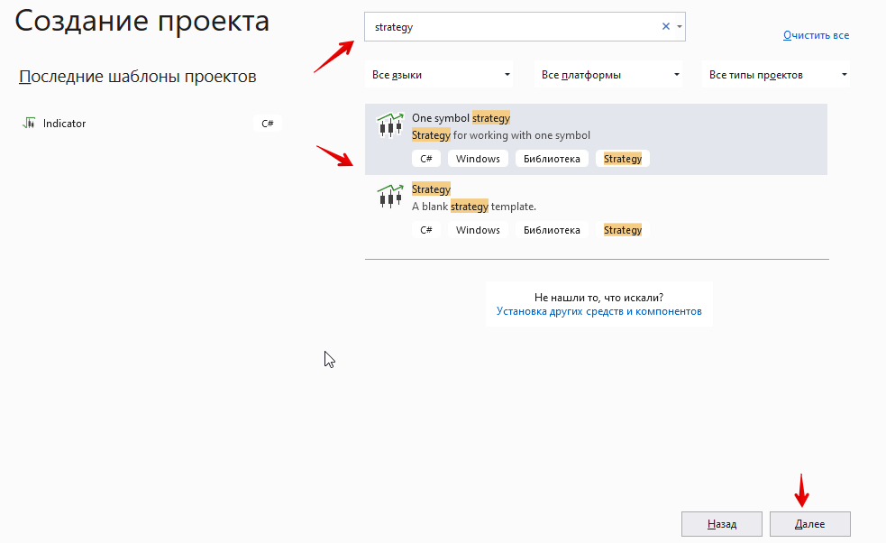
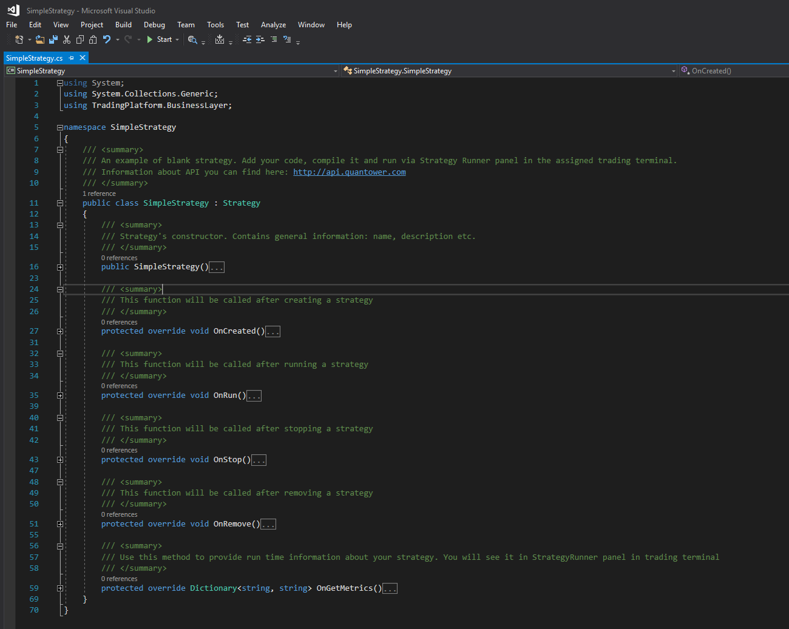

# Простая стратегия

В наших предыдущих статьях мы показали вам, как использовать расширение Quantower Algo и писать свои собственные индикаторы. Теперь мы покажем вам, как создать свою первую стратегию и запустить ее на торговой платформе Quantower.


Смотрите примеры некоторых стратегий, интеграций и индикаторов в нашем [репозитории Github.](https://github.com/Quantower/Examples)


## Что такое стратегия?

Мы используем название «Стратегия» для кода, который может реализовывать абсолютно любую логику и может выполняться в Quantower. Вы можете использовать стратегии для реализации торговых алгоритмов, особую логику управления ордерами закрытия \(например, трейлинг-стоп\), для арбитража между разными соединениями и т. Д. У нас нет никаких ограничений для этого, более того, мы предоставляем вам доступ практически ко всем функциям нашего торгового ядра.

Quantower Algo предоставляет вам два предопределенных шаблона стратегий. Мы начнем с пустого шаблона, который содержит только основные функции. Используйте **«Файл -&gt; Новый проект»** в главном меню Visual Studio, чтобы открыть окно «Новый проект». Введите «Стратегия», и вы увидите специальный тип проекта для пустой стратегии:



Вы получите сгенерированный код с несколькими пустыми функциями:



Как видите, эта пустая версия не имеет отношения к каким-либо торговым функциям - это всего лишь общая кодовая основа. Он унаследован от класса Strategy, этот Quantower распознает, что ваш код совместим и может быть выполнен в Quantower.

## Основные методы

Давайте углубимся в код - он содержит несколько методов:

### **OnCreated**

Вызывается, когда пользователь выбирает необходимую стратегию из поиска по стратегии. Используйте этот метод для реализации логики, которую необходимо выполнить один раз при создании.

### **OnRun**

Вызывается, когда пользователь нажимает кнопку Run на панели Strategy Runner. Используйте этот метод для установки начальных значений перед запуском.

### **OnStop**

Вызывается, когда пользователь нажимает кнопку Stop на панели Strategy Runner. Используйте этот метод, чтобы очистить состояние вашей стратегии \(при необходимости\).

### **OnRemove**

Будет вызываться, когда пользователь закроет панель запуска стратегии или выберет другую стратегию. Используйте этот метод для окончательной очистки использованных ресурсов.

### **OnGetMetrics**

С помощью этого метода вы можете отображать необходимую информацию на панели стратегии и управлять своей стратегией. Например, вы можете отобразить, сколько котировок было обработано, сколько было отправлено заказов на продажу и т. д.


Ко всем этим методам не нужно добавлять логику, чаще всего используется пара методов **OnRun / OnStop.**


Самый популярный случай - когда вы используете стратегию для реализации некоторого торгового алгоритма, и для этого вам нужен только один инструмент и одна учетная запись. Для этого у нас есть готовый шаблон - вы можете использовать его как основу. Используйте «Стратегию одного символа» в окне «Новый проект»:


Теперь у нас есть немного больше кода - стратегия содержит входные переменные Symbol и Account, которые мы описали ранее. Он подписывается на все типы котировок для выбранного символа в методе OnRun \(\), и вы можете получать и обрабатывать их, если этого требует ваш алгоритм.

## Пример

Давайте создадим какой-нибудь тривиальный пример и попробуем запустить его на платформе Quantower. О получении текущей торговой информации и торговых операциях мы поговорим в наших следующих статьях, а на текущий момент мы просто добавляем счетчики для каждого типа котировок и метрики стратегии для отображения в панели Strategy Runner. Мы также добавим примеры журналов - вы всегда должны их использовать, так как они могут помочь вам понять текущее состояние стратегии или отобразить информацию об ошибках. Вы можете указать тип журнала: Информация, Ошибка или Торговля.

```csharp
/// <summary>
/// Variables for counting quotes amount
/// </summary>
int quotesCount = 0;
int level2Count = 0;
int lastCount = 0;

/// <summary>
/// This method will be executed when strategy receive quote
/// </summary>        
private void SymbolOnNewQuote(Symbol symbol, Quote quote)
{
    // Increase quote counter
    quotesCount++;

    // An example of standard log
    Log("Quotes received", StrategyLoggingLevel.Info);
}

/// <summary>
/// This method will be executed when strategy receive level2 quote
/// </summary>        
private void SymbolOnNewLevel2(Symbol symbol, Level2Quote level2, DOMQuote dom)
{
    // Increase quote counter
    level2Count++;

    // An example of error log
    Log("Level2 received", StrategyLoggingLevel.Error);
}

/// <summary>
/// This method will be executed when strategy receive last quote
/// </summary>        
private void SymbolOnNewLast(Symbol symbol, Last last)
{
    // Increase quote counter
    lastCount++;

    // An example of trading log
    Log("Last received", StrategyLoggingLevel.Trading);
}

/// <summary>
/// Use this method to provide run time information about your strategy. You will see it in StrategyRunner panel in trading terminal
/// </summary>
protected override List<StrategyMetric> OnGetMetrics()
{
    List<StrategyMetric> result = base.OnGetMetrics();

    // Display our counters in Strategy Runner panel             
    result.Add(new StrategyMetric() { Name = "Quotes count", FormattedValue = quotesCount.ToString() });
    result.Add(new StrategyMetric() { Name = "Level2 count", FormattedValue = level2Count.ToString() });
    result.Add(new StrategyMetric() { Name = "Last count", FormattedValue = lastCount.ToString() });

    return result;
}
```

Создайте свой проект, и если ваш алгоритм Quantower правильно назначен экземпляру Quantower, ваша стратегия будет автоматически скопирована в соответствующую папку, и вы увидите ее в окне поиска стратегии:


Вам необходимо указать необходимые входные параметры: символ и счет, а затем нажать кнопку «Выполнить». Теперь ваша стратегия работает, и вы увидите журналы и показатели, которые мы добавили:


Это очень простой пример, который дает вам только базовые знания о том, как работают стратегии в Quantower. В наших дальнейших уроках мы покажем вам, как создавать настоящие алгоритмы, используя анализ вашего текущего торгового портфеля и торговых операций.

