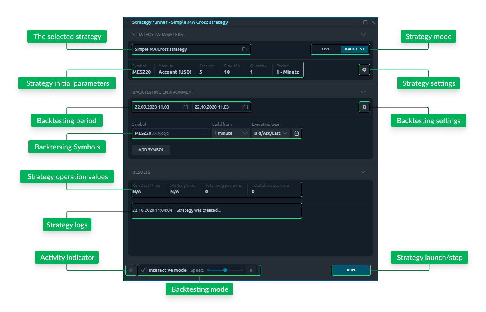
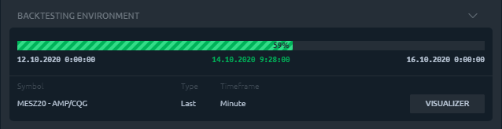

# Запуск и тестирование стратегий

## Видео инструкция

В этом видео описывается процесс создания простой автоматической торговой стратегии, а также практика работы с бегуном стратегий.



## Общее использование

Изначально эта панель состоит из двух частей: Параметры стратегии и Результаты.   
**-Раздел параметров** представляет собой настройки работы стратегии и позволяет изменять их перед запуском.   
**-В разделе «Результаты»** представлена ​​вся информация о ходе реализации стратегии после ее запуска. Прямо в нижнем колонтитуле панели запуска стратегии вы можете найти кнопку «Выполнить», которая изменится на «Стоп» после запуска стратегии.

В целом, чтобы начать автоматическую торговлю, вам необходимо:

1. Запустить панель раннера стратегии
2. Выберите необходимую стратегию
3. Настроить параметры автоматической торговли
4. Нажмите кнопку Run

## Параметры стратегий

У стратегии обычно есть собственные входные параметры, которые были объявлены в ее коде. Обычно это Symbol, Account и некоторые другие параметры.


Перед запуском стратегии в режиме Live необходимо внимательно проверить и предоставить все необходимые данные. Обратите внимание, что неправильно настроенный ATS может привести к огромным денежным потерям.


Когда вы работаете в режиме бэктестинга, первый выбранный для бэктестирования символ и его учетная запись будут автоматически применены к настройкам стратегии.

## Запуск и остановка

Кнопка **«Выполнить»** в нижнем колонтитуле панели инициирует запуск выбранной стратегии \(включая загрузку исторических данных\) и другие подготовительные шаги. После запуска стратегии кнопка «Выполнить» преобразуется в кнопку «Стоп», позволяя остановить процесс.

## Полученные результаты

В этом разделе отображается общая статистика работы стратегии, такая как Дата / время запуска \(когда она была запущена\), Время работы \(сколько времени она работает\) и любые дополнительные параметры, специфичные для каждой отдельной стратегии. Самая нижняя часть блока результатов - это список журналов, где стратегия выводит все действия, которые она выполняет во время работы.

## Режим тестирования на истории

Еще одно использование этой панели - это режим тестирования на истории. При выборе стратегии вы найдете переключатель с двумя вариантами работы стратегии: **Live и Backtest.** Первый вариант запустит вашу стратегию с текущими торговыми данными по выбранному счету и символу. Но если вы перейдете в режим тестирования на истории, вы увидите дополнительный блок, посвященный среде тестирования на истории. Этот режим позволяет пользователю протестировать стратегию, прежде чем использовать ее. Фактически, в режиме тестирования на истории все действия стратегии будут полностью эмулироваться на некоторых исторических данных.

### Настройка тестовой среды

Во-первых, укажите **Исторический период** для тестирования. Это период исторических данных, которые будут загружены для выбранного символа.

Затем укажите **символ для тестирования**. Это символ поставщика данных, к которому вы в настоящее время подключены. Дополнительно вы можете выбрать следующие параметры данных символа:

* Опция **Build from** указывает, как исторические данные должны быть агрегированы для целей тестирования: 

  * Тики позволяют имитировать наиболее точный поток данных, аналогичный «реальному» поведению рынка.  Лучше всего подходит для ежедневного тестирования периодов и стратегий высокочастотной торговли. 
  * 1-минутная агрегация хороша для еженедельного тестирования.  Эта агрегация позволяет нам уменьшить объем исторических данных и ускорить процесс тестирования на исторических данных. 
  * Однодневное агрегирование лучше всего подходит для тестирования большого количества исторических данных \(месяцы, годы\) и сезонных изменений рынка.

  \_\_

* Опция **Executing type** указывает, какие данные следует использовать для тестирования: Bid / Ask / Last или просто последние рыночные данные. В зависимости от вашего поставщика данных вы не сможете получить исторические данные о ставках / спросе / последнем.


Обратите внимание, что агрегирование Ticks может привести к высокому потреблению интернет-трафика и нагрузке на процессор компьютера при тестировании на исторических данных, если оно используется с длительным историческим периодом.


Если ваша стратегия требует дополнительных данных для анализа, вы можете указать несколько символов для тестовой среды. Эти символы в дальнейшем можно будет использовать для указания в разделе параметров работы стратегии.

### Настройки среды

Также имеется дополнительный экран настроек, позволяющий настроить некоторые параметры, специфичные для биржи или рынка, чтобы имитировать наиболее точную и «настоящую» среду тестирования. Есть вкладка "Просмотр" для общих параметров и вкладки "По выбранному символу" для указания параметров, связанных с символом.

* **Первоначальный баланс.** Это поле позволяет вам установить начальный баланс вашей тестовой учетной записи.
* **Схема моделирования.** Здесь вы можете указать, как бэктестер должен генерировать котировки из истории исходных баров:
  * OHLC. Для каждого бара будет сгенерировано 4 котировки с использованием цен открытия, максимума, минимума и закрытия.
  * Открыть. Будет сгенерирована только одна котировка на бар с использованием цены открытия.
  * Закрыть. Будет сгенерирована только одна котировка на бар с использованием цены закрытия. Обратите внимание, что эти правила могут применяться только в том случае, если вы предоставляете историю бара в качестве исходных данных для бэктестера. Когда вы предоставляете тиковые данные, тестер генерирует котировку для каждого тика.
* **Тип сетки.** Эта опция определяет, как должен вести себя ваш бэктестер, когда вы открываете несколько позиций на один символ.
  * Одна позиция. Все новые позиции будут объединены с первой открытой.
  * Несколько с каждой стороны. Все новые позиции будут объединены с первой открытой, но отдельно для каждой торговой стороны.
  * Несколько позиций. Все новые позиции будут открываться отдельно.
* **Комиссии по сделке.** Вы можете установить размер комиссии, которая будет добавляться к каждой сделке, совершаемой вашей стратегией. Это значение должно быть установлено в валюте котировки \(например, в валюте вашей тестовой учетной записи\).

### Контроллеры для тестирования на истории

Еще одна особенность панели «**Запуск и тестирование стратегий**» - интерактивный режим. Он расположен в нижнем колонтитуле панели и включен по умолчанию. Этот режим позволяет более точно отслеживать процесс тестирования и даже контролировать его скорость.

Интерактивный режим дает возможность визуализировать действия стратегии с помощью различных панелей терминала Quantower. Ползунок скорости замедляет или ускоряет процесс воспроизведения исторических данных. Наименьшее значение Speed ​​приостанавливает стратегию и активирует кнопку воспроизведения «за тик» \(фактически за значение «Build from»\).


Обратите внимание: когда вы нажимаете кнопку «Стоп» в режиме тестирования на истории, результаты вашей стратегии будут стерты, и вы больше не сможете получить к ним доступ.


### Результаты тестирования на истории

Когда вы запускаете свою стратегию в режиме тестирования на истории, раздел среды тестирования на истории преобразуется в раздел Прогресс. Здесь вы можете увидеть индикатор выполнения воспроизведения истории и кнопку визуализатора с правой стороны каждой строки символов.

Кнопка Visualizer позволяет нам открывать некоторые панели Quantower и визуально отслеживать работу стратегии во время воспроизведения истории. Самыми интересными панелями являются «Производительность счета», показывающая торговые результаты вашей стратегии, и панель «График», на которой сделки отображаются с помощью визуального торгового интерфейса. Вы также можете визуализировать процесс тестирования на различных панелях, таких как Time & Sales, DOM Surface, TPO Chart и т. Д.

Когда вы работаете со своим собственным кодом, вы будете постоянно изменять свою стратегию и должны сообщать исполнителю стратегии, чтобы он использовал последнюю версию. В этом случае, когда вы создадите свой код, вы заметите кнопку «Новая версия» прямо рядом с кнопкой «Выполнить». Примените новый код, нажав эту кнопку, и затем вы сможете протестировать обновленную стратегию.

### Быстрое тестирование на истории

В интерактивном режиме процесс тестирования на истории имеет ограниченную максимальную скорость, но что, если нам не нужно визуализировать работу стратегии, а просто получить окончательные результаты? Отключение интерактивного режима обеспечит максимально возможную скорость тестирования на истории, и вы увидите, что тот же период истории был обработан намного быстрее. В этом случае вы не сможете визуализировать процесс тестирования на истории, а увидеть результаты только после того, как будет обработан выбранный период истории.

## Уведомление о рисках

Все автоматические торговые стратегии несут риск, даже если долгосрочная прибыльность положительна. Не существует идеальной системы и системы, которая всегда выигрывает. Любые инвестиции в ATS сопряжены с большими рисками, и показанные результаты не должны закрывать глаза на эти риски. Важно отметить, что наихудшая полоса неудач системы чаще всего еще впереди и может произойти, когда система активна в учетной записи пользователя. Обстоятельства рынка могут измениться по сравнению с периодом, в котором система была разработана, и правила системы, которые давали положительную отдачу в прошлом, могут начать давать отрицательную отдачу.

Торговая платформа Quantower выполняет заказы, отправленные ATS для учетной записи Пользователя на «не удерживаемой» основе, что означает, что Quantower не несет ответственности за выполнение заказа по указанной цене или иным образом; и не несет ответственности за работу ATS, включая любые потенциальные торговые убытки, которые пользователь может понести в результате использования ATS.

IВ частности, Quantower не несет ответственности за любые убытки, которые могут возникнуть в результате неправильного функционирования ATS, а также за любые технические проблемы, не связанные с торговой платформой Quantower.

