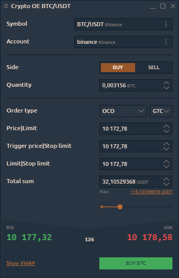
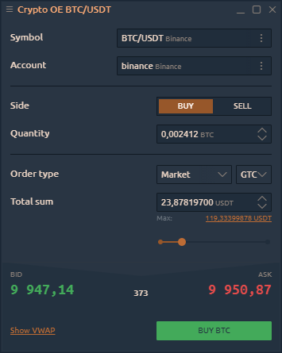

# Ввод крипто-ордера

Панель ввода крипто-ордеров позволяет создавать торговые ордера с различными условиями, такими как количество ордеров, цена, сторона, тип ордера, и отправлять их на рынок. На панели ввода крипто-заказов вы можете предоставить всю необходимую информацию для заказа и легко отправить ее, нажав соответствующую кнопку действия.

Эта панель идентична основной [**панели ввода ордеров,**](https://help.quantower.com.ru/trading-panels/order-entry) но работает только при активном торговом подключении к криптобирже.


Если криптобиржа подключена в информационном режиме, панель не будет активной.


## **Order types and restrictions**

Crypto Order Entry automatically lists all exchange-supported order types available for the associated instrument under the selected connection. Within our existed connections we support:

* **Market order** is an order placed without a price with the intention of hitting the best Bid or taking the best Offer currently available in the market. The order fills at the current best price. Unlike limit orders, where orders are placed on the order book, market orders are executed instantly at the current market price, meaning that you pay the fees as a market taker.

* **Limit order** allows submitting an order at a specific limit price or better.

