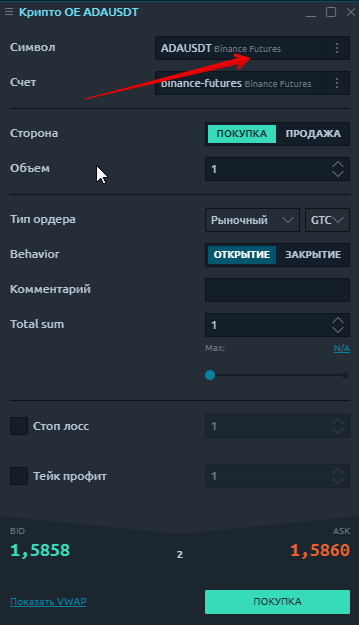
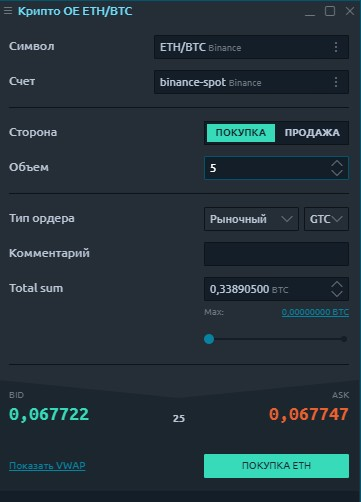

# Ввод крипто-ордера

Панель ввода крипто-ордеров позволяет создавать торговые ордера с различными условиями, такими как количество ордеров, цена, сторона, тип ордера, и отправлять их на рынок. На панели ввода крипто-заказов вы можете предоставить всю необходимую информацию для заказа и легко отправить ее, нажав соответствующую кнопку действия.

Эта панель идентична основной [**панели ввода ордеров,**](https://help.quantower.com.ru/trading-panels/order-entry) но работает только при активном торговом подключении к криптобирже.


Если криптобиржа подключена в информационном режиме, панель не будет активной.


## Типы заказов и ограничения

Панель ввода крипто ордера автоматически перечисляет все поддерживаемые обменом типы ордеров, доступные для связанного инструмента при выбранном соединении. В рамках существующих подключений мы поддерживаем:

* **Рыночный ордер** - это ордер, размещаемый без цены с намерением получить лучшую ставку или лучшее предложение, доступное в настоящее время на рынке. Ордер исполняется по текущей лучшей цене. В отличие от лимитных ордеров, в которых ордера размещаются в книге ордеров, рыночные ордера исполняются мгновенно по текущей рыночной цене, что означает, что вы платите комиссию как участник рынка.

* **Лимитный ордер** позволяет выставить ордер по определенной лимитной цене или лучше.

