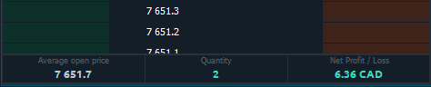

# DOM Трейдер

## Введение в DOM Трейдер

**Панель стакана цен** или **DOM Трейдер** показывает количество ордеров на покупку и продажу, размещенных на различных ценовых уровнях вокруг текущей цены для определенного инструмента \(чаще всего для фьючерсов\). Чем больше заказов на определенном уровне цен, тем выше интерес к этому уровню. Торговый функционал панели позволяет быстро и эффективно размещать необходимое количество ордеров по выбранной цене, а также перетаскивать, изменять или отменять их.

## Как торговать с DOM Трейдер

DOM Трейдер позволяет отправлять торговые приказы тремя способами - режим торговли мышью, ввод ордеров и горячие клавиши.

Чтобы разместить ордер в режиме торговли мышью:

* Выберите учетную запись и ограничение заказа \(TIF\) в вводе заказа;

  Введите количество заказа;

* Щелкните левой кнопкой мыши по определенной цене в левом столбце, чтобы разместить лимитный ордер на покупку \(ниже текущей рыночной цены\);
* Щелкните левой кнопкой мыши по определенным ценам в правом столбце, чтобы разместить лимитный ордер на продажу \(выше текущей рыночной цены\). Если вы разместите ордер ниже текущей цены, он будет исполнен по рыночной цене;
* Для выставления стоп-приказа необходимо нажать и удерживать клавишу Shift и щелкнуть по нужной цене.

Чтобы разместить заказ через панель Ввод заказов:

* Выберите учетную запись и ограничение заказа \(TIF\) в вводе заказа;

  Введите количество заказа;

  Нажмите кнопку Bid, Ask или Market, чтобы разместить заказ;

  Установите стоп-лосс и тейк-профит \(брекет-ордера\)

  Подтвердите свое размещение, предварительно проверив все параметры.



## DOM Trader settings

Additional settings of the DOM Trader allow you to customize the general view for convenient display of data and the panel in general. To open DOM Trader settings, click on the Menu button on the left upper corner and select Settings item.

The general view of DOM Trader settings menu has the following subsections. Let's take a closer look at them:

* **View**
* **Columns**
* **Order Entry**
* **Positions Bar**
* **Hotkeys**

### View settings

* **Custom title.** You can rename the DOM Trader panel as you wish.
* **Refresh rate \(ms\)** controls the rate at which market data is updated. This determines how often the platform processes changes in depth of market. With a value of 1, all changes to the level2 data will be processed immediately. We recommend using value 50. 
* **Use custom tick size.** 
* **Short price format**
* **Split size columns.** A mode that allows you to place Ask and Bid volume on one or different sides of the Size column;
* **Custom session.** This item is for selecting trading sessions for Volume Analysis data primarily.
* **Full-size cells.** Color scheme for Size column;
* **Show order entry.** This option shows/hides an Order Entry on the panel for quick order placement;
* **Collapse spread.** Hide or show the spread between the current Bid / Ask prices on the price ladder;
* **Show day map.** Display the upper horizontal scale, which shows the current price position relative to the High and Low of the day;
* **Show toolbar.**  This option shows/hides the top toolbar with the trading symbol and expands the "useful" area of the panel. It is recommended to use this option with the symbol link.
* **Show Level 1 bar.** Shows/hides the header pane, which contains Level 1 market data for the selected instrument.

### Position Bar settings

At the bottom of the DOM Trader is the Position Bar, which displays brief info about an open position on the current trading instrument — the number of contracts, the average open price, current Profit/Loss and Liquidation price.

### Hotkeys

This tab is for configuring your keyboard shortcuts. Here you can configure the order size with one button and place it to the market. Cancel orders and many other useful functions.

