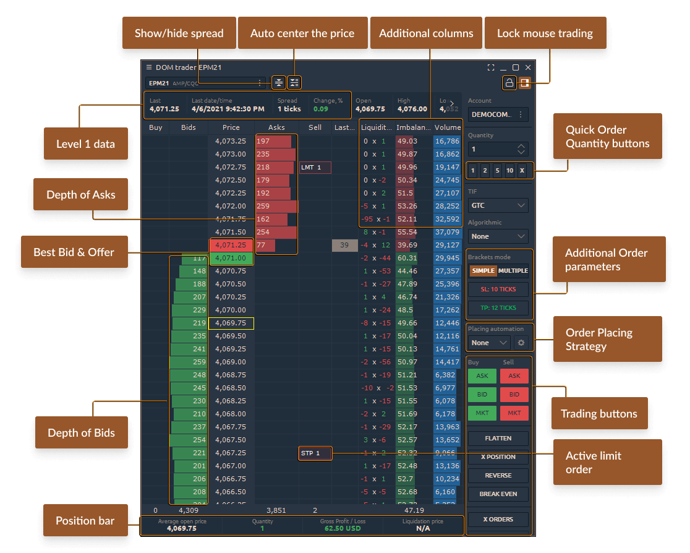
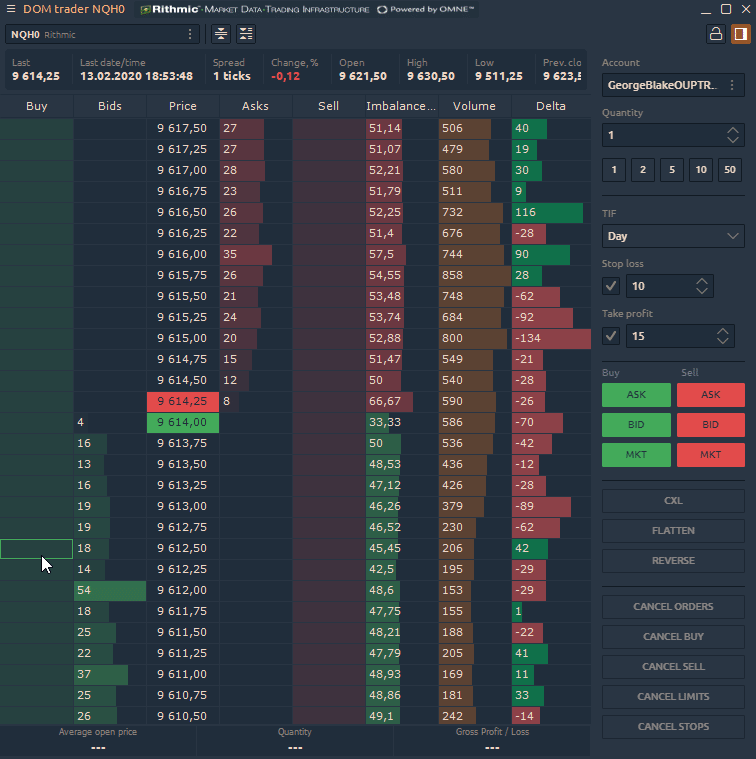
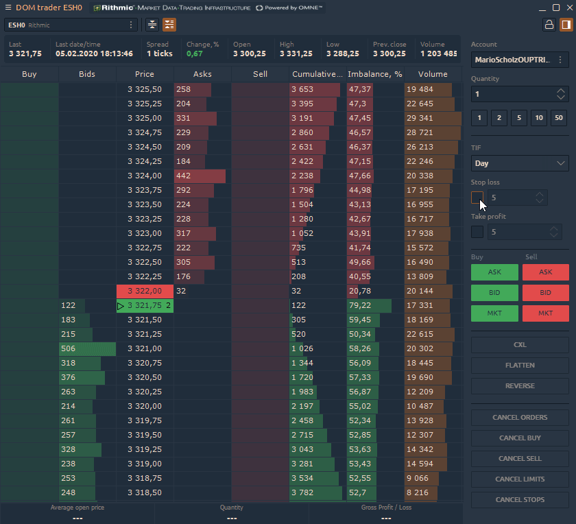
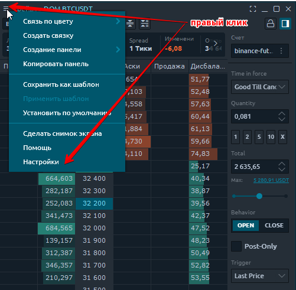
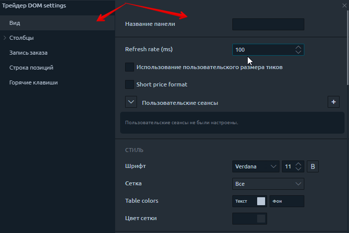
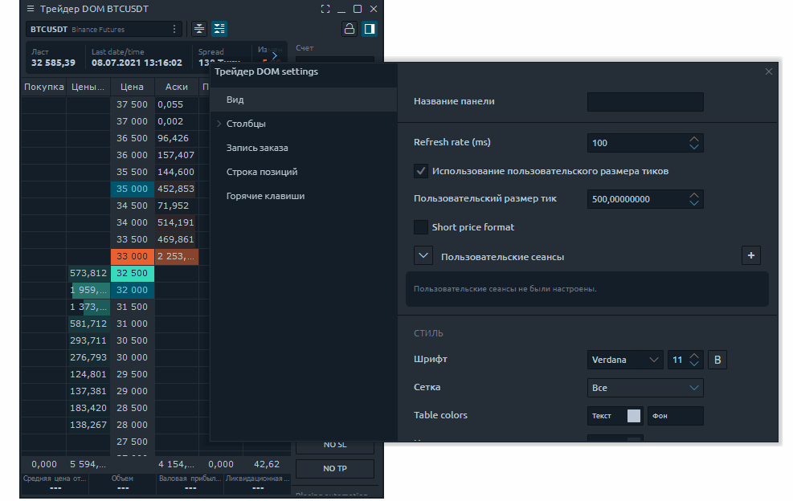
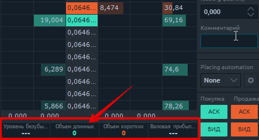
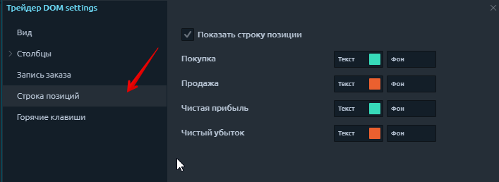
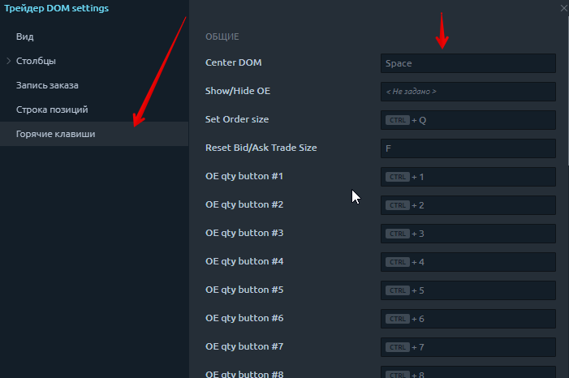

# DOM Трейдер

## Введение в DOM Трейдер

**Панель стакана цен** или **DOM Трейдер** показывает количество ордеров на покупку и продажу, размещенных на различных ценовых уровнях вокруг текущей цены для определенного инструмента (чаще всего для фьючерсов). Чем больше заказов на определенном уровне цен, тем выше интерес к этому уровню. Торговый функционал панели позволяет быстро и эффективно размещать необходимое количество ордеров по выбранной цене, а также перетаскивать, изменять или отменять их.

## Как торговать с DOM Трейдер

DOM Трейдер позволяет отправлять торговые приказы тремя способами - режим торговли мышью, ввод ордеров и горячие клавиши.

Чтобы разместить ордер в режиме торговли мышью:

*   Выберите учетную запись и ограничение заказа (TIF) в вводе заказа;

    Введите количество заказа;
* Щелкните левой кнопкой мыши по определенной цене в левом столбце, чтобы разместить лимитный ордер на покупку (ниже текущей рыночной цены);
* Щелкните левой кнопкой мыши по определенным ценам в правом столбце, чтобы разместить лимитный ордер на продажу (выше текущей рыночной цены). Если вы разместите ордер ниже текущей цены, он будет исполнен по рыночной цене;
* Для выставления стоп-приказа необходимо нажать и удерживать клавишу Shift и щелкнуть по нужной цене.

Чтобы разместить заказ через панель Ввод заказов:

*   Выберите учетную запись и ограничение заказа (TIF) в вводе заказа;

    Введите количество заказа;

    Нажмите кнопку Bid, Ask или Market, чтобы разместить заказ;

    Установите стоп-лосс и тейк-профит (брекет-ордера)

    Подтвердите свое размещение, предварительно проверив все параметры.


Панель DOM Трейдер в Quantower


## Как настроить Панель DOM Трейдер

Дополнительные настройки DOM Trader позволяют настроить общий вид для удобного отображения данных и панели в целом. Чтобы открыть настройки DOM Trader, нажмите кнопку «Меню» в левом верхнем углу и выберите пункт «Настройки».

Общий вид меню настроек DOM Trader состоит из следующих подразделов. Рассмотрим их подробнее:

* Вид
* Столбцы
* Ввод ордера
* Панель позиций
* Горячие клавиши

### Настройка внешнего вида

* **Произвольное название**. Вы можете переименовать панель DOM Trader по своему желанию.
* **Частота обновления (мс) **контролирует скорость обновления рыночных данных. Это определяет, как часто платформа обрабатывает изменения в стакане цен. При значении 1 все изменения данных уровня 2 будут обрабатываться немедленно. Мы рекомендуем использовать значение 50.
* Использование **пользовательского размера тиков**. Этот параметр настраивает шаг цены. Вы можете установить пользовательский размер шага цены для каждой пары.&#x20;

* **Краткий формат цены**
* **Индивидуальная сессия**. Этот пункт предназначен для выбора торговых сессий в первую очередь для данных анализа объема.
* **Цветовая схема ;**
* **Показать/скрыть  заголовок таблицы , **расширяет «полезную» область панели.&#x20;
* **Показать/скрыть итоги, **расширяет «полезную» область панели.&#x20;
* **Показать панель инструментов.** Эта опция показывает / скрывает верхнюю панель инструментов с торговым символом и расширяет «полезную» область панели. Рекомендуется использовать эту опцию с символьной ссылкой.
* **Показать панель уровня 1.** Показывает / скрывает панель заголовка, содержащую рыночные данные уровня 1 для выбранного инструмента.

### Настройки строки открытых позиций

Внизу DOM Trader находится строка открытых позиций, которая отображает краткую информацию об открытых позициях по текущему торговому инструменту - количество контрактов, среднюю цену открытия, текущую прибыль / убыток и цену ликвидации.

### Горячие клавиши

Эта вкладка предназначена для настройки сочетаний клавиш. Здесь вы можете настроить размер ордера с помощью одной кнопки и выставить его на рынок. Отмена заказов и множество других полезных функций.

