# Как настроить панель DOM Трейдер для скальпинга

Чтобы открыть настройки DOM Trader, нажмите кнопку «Меню» в левом верхнем углу и выберите пункт «Настройки».

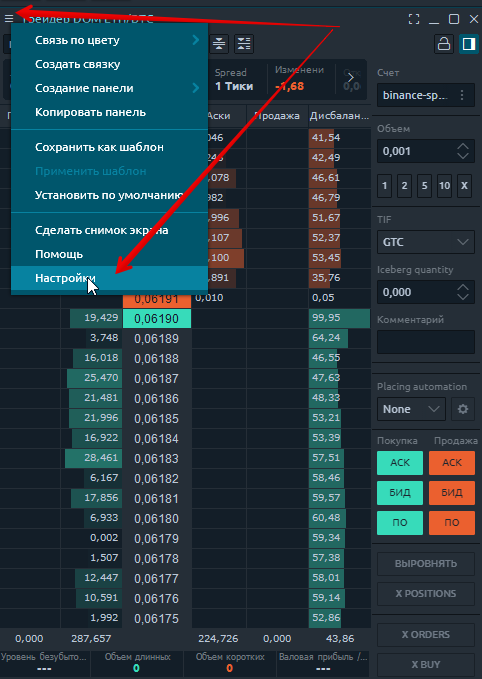

## Скорость обновления Dom Trader

Этот параметр влияет на то, как часто данные будут обновляться в Dom Трейдер. Вам нужно поэкспериментировать и найти оптимальную настройку для вашего региона.\
Чем ниже данный параметр, тем чаще будут обновляться данные, и соответственно наоборот.


Слишком частое обновление Dom Трейдер может привести к значительным задержкам в обработке данных, если у вас слабый компьютер.


### Как сделать важные уровни DOM более заметными 

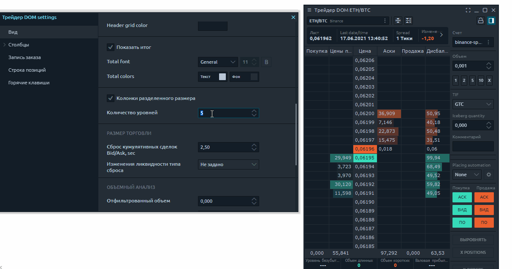

Для начала установите большее количество уровней, чем установлено по умолчанию, например на 100. Вы можете установить любое значение, какое Вам нужно использовать в вашей торговой системе.\
\
Следующим шагом измените шрифт и размер **шрифта в настройках общего вида.**&#x20;

Данный размер шрифта будет применен сразу ко всем колонкам и при изменении размера шрифта, автоматически будет изменяться размер строки, что визуально дает возможность настроить так, как Вам удобно с выбранным инструментом.

Если необходимо выделить отдельно какой либо столбец, или отдельно увеличить шрифт любого столбца в таблице, для этого есть более тонкая настройка. Таким образом,  можно столбец с ценой сделать визуально больше, назначив ему больший шрифт.

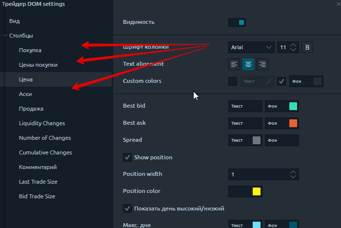

Теперь ваш Dom Trader должен выглядеть как на картинке. Растяните вашего Dom-трейдера на весь монитор, и вы увидите всю доступную информацию.

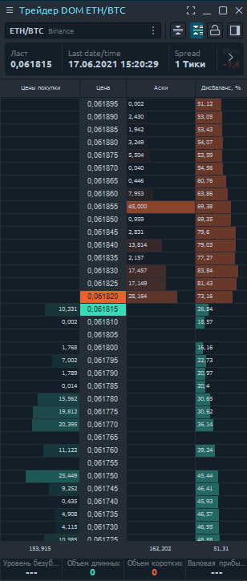

## Как установить бид аск в одном столбце

Чтобы установить бид и аск друг над другом, используйте разделение столбцов размера. Перед этим, закройте панель настроек трейдера DOM!

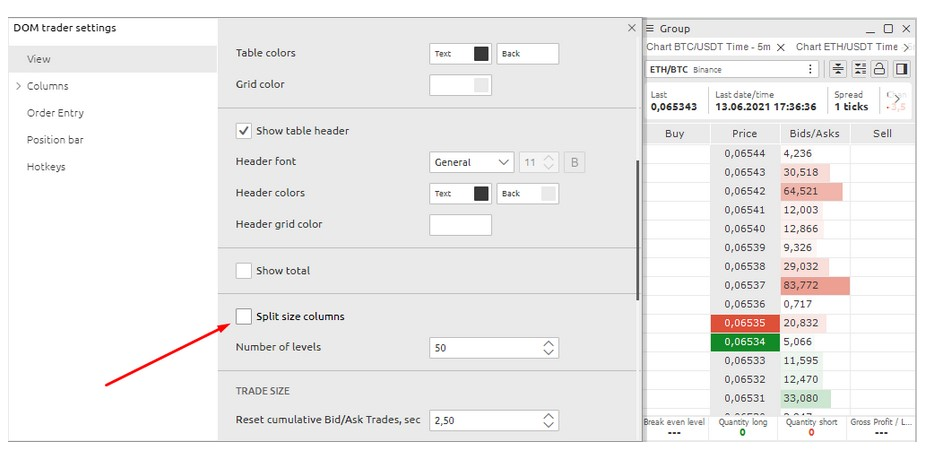

Теперь его можно настроить как отдельный столбец, применив для него свой шрифт и цветовую гамму.

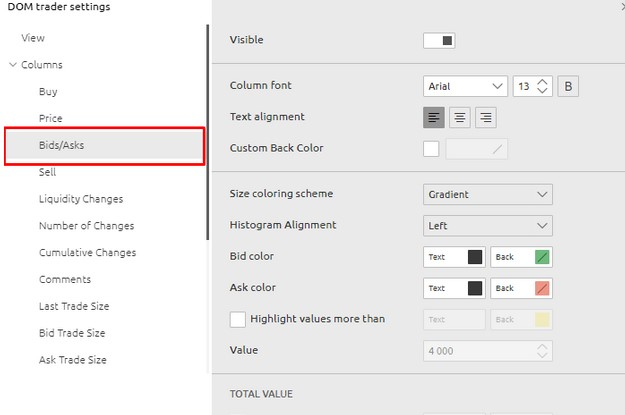


Обратите внимание, что после применения этой настройки вы должны закрыть ПАНЕЛЬ с настройками и снова открыть ее. Вы увидите новый столбец BID / ASK - это будут общие настройки для этого столбца. Возможно, вам придется отредактировать их снова, чтобы улучшить читаемость DOM трейдер.


## Как выделить большие объемы в Dom **Т**рейдер

**Суть скальпинга** - видеть в стакане большие ордера и действовать в контексте рыночной ситуации. Давайте посмотрим, как можно для этого настроить панель  Dom Трейдер .&#x20;

Для этого переходим в настройки столбца и выбираем Bids and Asks. Сначала можно  настроить градиент, и подобрать удобный цвет для глаз. Наблюдайте за стаканом, выбирайте действительно большие объемы и укажите  это значение в настройках.

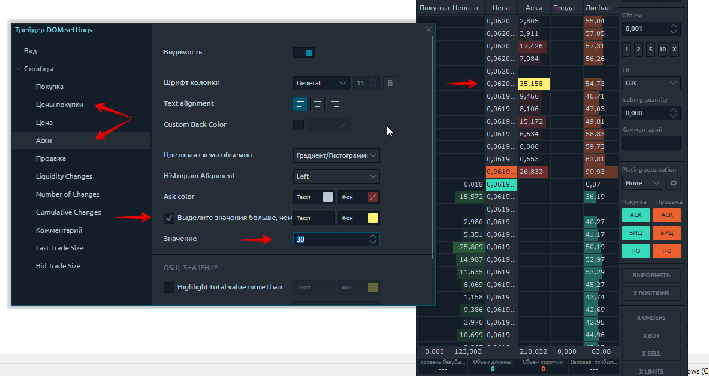

## Как настроить быструю торговлю и смену объема позиции?

**Ввод ордеров** в Dom Трейдер можно осуществлять разными вариантами, в зависимости от выбранного стиля торговли:

* _с панели быстрого ввода ордеров рядом со стаканом_&#x20;
* &#x20;_путем настройки и торговли с_ [_горячих клавиш._ ](https://help.quantower.com.ru/analytics-panels/chart/chart-settings#goryachie-klavishi)
* _Торговля мышью сразу со стакана_&#x20;

Справа на верхней панели инструментов Dom Трейдер есть кнопка открытия панели быстрого ввода ордера.&#x20;

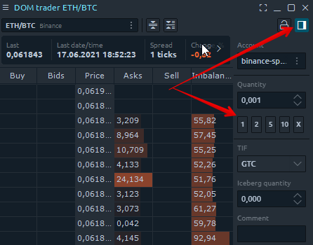

Вы можете настроить стандартные значения суммы ордера, которые  соответствует вашим рискам для быстрого вызова одним нажатием. Кнопки могут изменять не только на заданный объем позиции, но и применять любые формулы добавления позиции с K c шагом и т.д

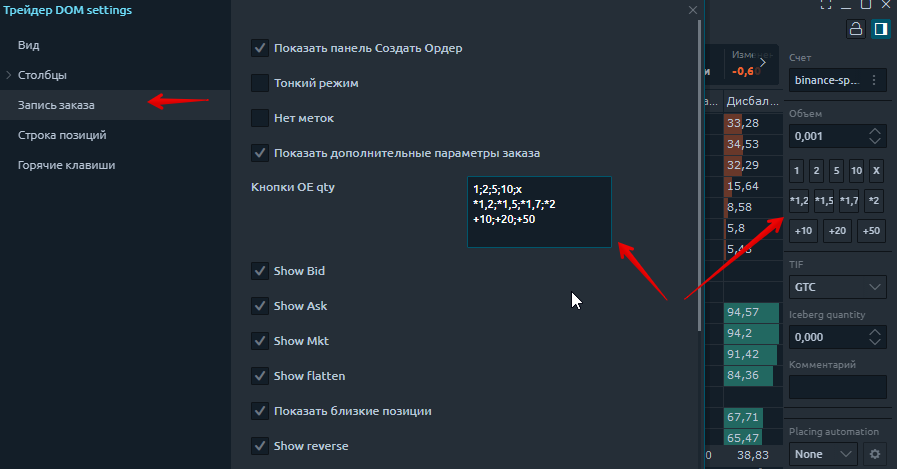

И конечно, самое важное для скальперской торговли это настройка  **горячих клавиш.** Здесь вы можете настроить изменение объема одной кнопкой. Отмена заказов и множество других полезных функций. В общем, **практически любое действие можно назначить** по своему желанию.

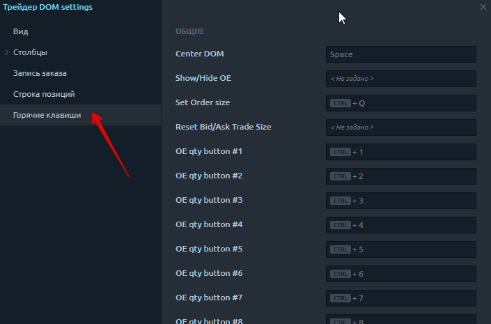

По умолчанию **торговля мышью** заблокирована для того, что бы избежать ошибочной установки ордера.&#x20;

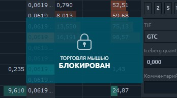

Что бы ее разблокировать, нужно нажать "замок" на верхней панели:

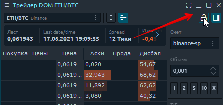

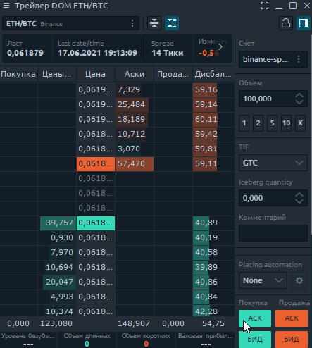

* Щелкните левой кнопкой мыши по определенной цене в левом столбце, чтобы разместить лимитный ордер на покупку (ниже текущей рыночной цены);
* Щелкните левой кнопкой мыши по определенным ценам в правом столбце, чтобы разместить лимитный ордер на продажу (выше текущей рыночной цены). Если вы разместите ордер ниже текущей цены, он будет исполнен по рыночной цене;
* Для выставления стоп-приказа необходимо нажать и удерживать клавишу Shift и щелкнуть по нужной цене.

\

