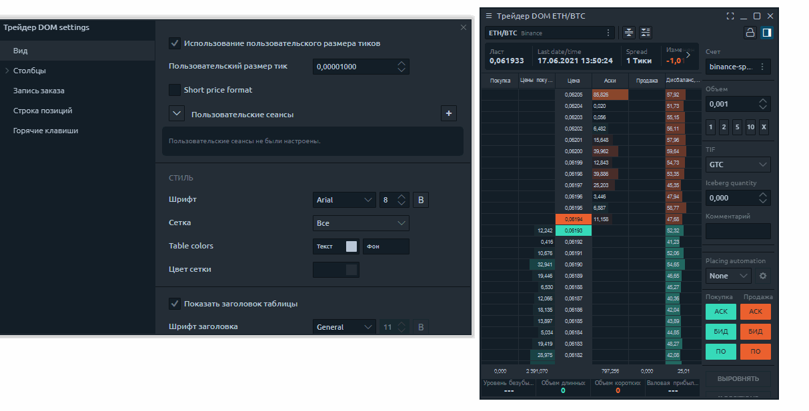

# Как настроить панель DOM Трейдер для скальпинга

## Скорость обновления Dom Trader

Этот параметр влияет на то, как часто данные будут обновляться в Dom Трейдер. Вам нужно поэкспериментировать и найти оптимальную настройку для вашего региона.  
Чем ниже данный параметр, тем чаще будут обновляться данные, и соответственно наоборот.


Слишком частое обновление Dom Трейдер может привести к значительным задержкам в обработке данных, если у вас слабый компьютер.


### Как сделать важные уровни DOM более заметными 

Для начала установите количество уровней на 100. Вы можете установить любое значение, какое Вам нужно использовать в вашей торговой системе.  
  
Следующим шагом измените шрифт и размер шрифта в настройках общего вида. При изменении размера шрифта, автоматически будет изменяться размер строки, что визуально дает возможность настроить так, как Вам удобно с выбранным инструментом

**Суть скальпинга** - видеть в стакане большие ордера и действовать в контексте рыночной ситуации. Давайте посмотрим, как я настраивал Dom. Итак, для этого переходим в настройки столбца и выбираем Bids and Asks. Сначала убираю настройку градиента, это немного неудобно для моих глаз. Я хочу видеть контрастирующие объемы. Наблюдайте за Домом, выбирайте действительно большие объемы и указывайте это значение в настройках.

Next, I specify my **standard volumes** for the trade. According to my money management I take the following shoulders 1, 2, 5,10, 20. It is very convenient to quickly change volume based on market situation.

For **instant order management** I use quick response panel and hotkeys/ I learned some hotkeys and use keyboard to trade. For example, I quickly close a position or flip a position from buying to selling.

