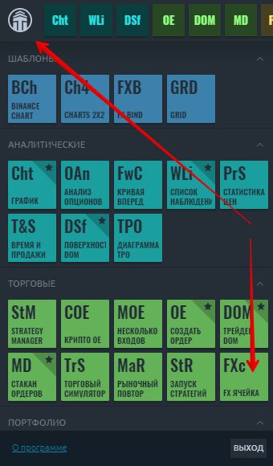
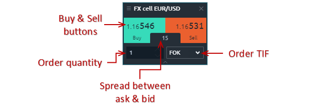
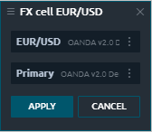

# Ячейка FX

## Что такое ячейка FX

Панель ячеек FX обеспечивает комбинацию двух важных функций - данных котировок и управления торговлей для размещения ордеров. Он был разработан для трейдеров FX, но его можно использовать с любыми символами для любого рынка.

Меню панели ячеек FX содержит:

* **Редактировать** - позволяет изменить счет или торговый символ;
* **Связать** - позволяет связать несколько панелей общим символом с использованием определения цвета. Просто выберите один цвет ссылки в FX Cell и на другой панели, и у них будет параметр синхронизированного символа. После установки связи заголовок панели будет окрашен в соответствующий цвет.
* **Дублировать панель** - позволяет создать копию панели с такими же настройками.

## Торговля с ячеек FX

* **Выберите торговый инструмент и счет.** Вы можете выбрать торговый символ вручную или связав его со списком наблюдения или другими панелями.

* **Установите размер заказа.** Щелкните поле размера и введите новое значение или используйте колесико мыши для перехода к новому значению.
* **Установите длительность заказа (TIF)**. В зависимости от выбранного подключения типы TIF могут различаться.
* **Сделайте заказ.** Заказы размещаются путем нажатия кнопок покупки или продажи. Вы должны подтвердить заказ перед его размещением.

Вы можете управлять своими открытыми позициями с помощью панели [**Открытые позиции**](https://help.quantower.com.ru/portfolio-panels/positions)****
