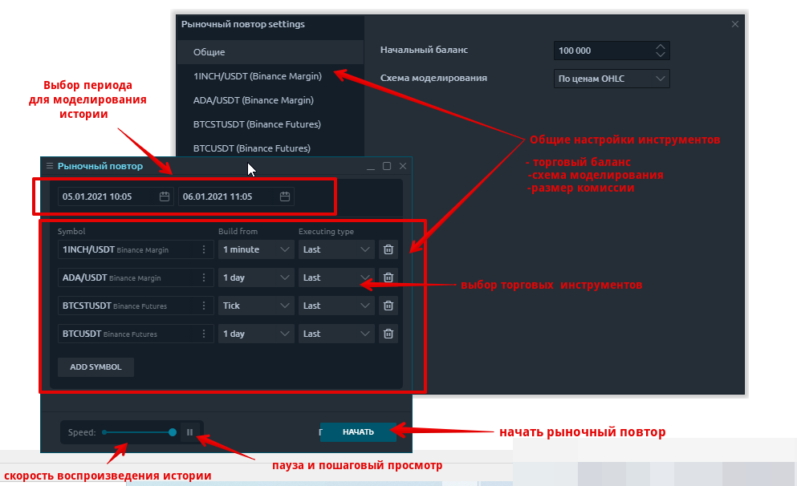
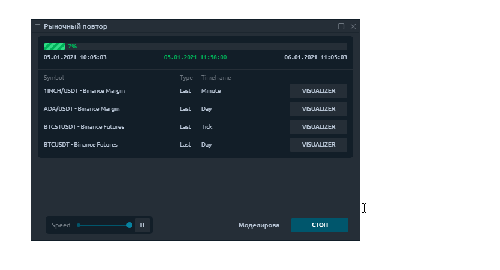
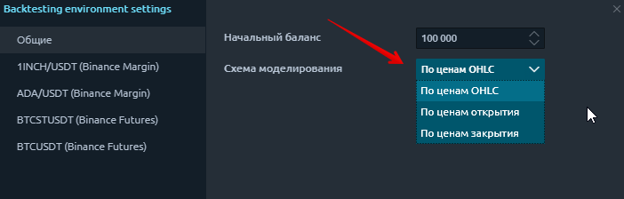
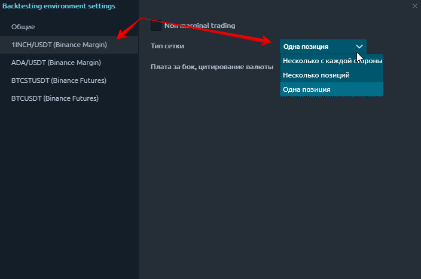

# Рыночный повтор

* \*\*\*\*[**Что такое рыночный повтор**](history-player.md#chto-takoe-rynochnyi-povtor)\*\*\*\*
* \*\*\*\*[**Первый запуск Рыночного повтора**](history-player.md#pervyi-zapusk-rynochnogo-povtora)\*\*\*\*
* \*\*\*\*[**Общие настройки инструментов**](history-player.md#obshie-nastroiki-instrumentov)\*\*\*\*

## Что такое рыночный повтор

Тестирование торговых стратегий - один из важнейших и необходимых шагов для успешной торговли. Если вы опытный алгоритмический трейдер, то метод автоматического тестирования идеален, и вы можете использовать наше [Расширение для Visual Studio.](https://help.quantower.com.ru/quantower-algo/installing-visual-studio) Но, к сожалению, многие трейдеры не знают языка программирования, что затрудняет тестирование их стратегий.

Поэтому Quantower предоставляет панель **Рыночный повтор** \(или Повтор истории\) для простого ручного тестирования любой торговой стратегии.

Повтор истории позволяет вам тестировать на любых торговых инструментах с любым поставщиком или брокером. Это особенно полезно, когда у вас есть доступ к потоку данных, который не позволяет выполнять заказы \(каналы даты котировок, такие как IQFeed или криптобиржа\).



## Первый запуск Рыночного повтора

* **Запустите панель** **Рыночный повтор** из главного меню приложения
* Добавьте торговый инструмент для тестирования
* Установите тип данных - Тик, 1 минута, 1 день
* Установите тип исполнения - Last или Bid / Ask / Last
* Нажмите кнопку **«Пуск»**, чтобы начать тестирование.

В нашем блоге мы подробно показали [процесс ручного тестирования торговых стратегий с помощью панели Market Replay.](https://www.quantower.com/blog/software-for-manual-backtesting-a-brief-review-of-history-player-plugin)


Если вы нажмете кнопку «Стоп», весь процесс тестирования будет отменен.


После запуска тестирования вы можете открыть все необходимые панели для тестирования, нажав кнопку «Открыть панель».

## Общие настройки инструментов

Перед тем, как начать тестирование стратегии, вам необходимо настроить начальный торговый баланс, схему имитации \(или моделирования\) для загружаемых данных, размер комиссии для торгового инструмента и тип неттинга.

Тестирование стратегии может выполняться по одной из трех схем на выбор:

* **OHLC -** в этом режиме последовательность строится только по ценам OHLC минутных баров, количество генерированных контрольных точек значительно сокращается - отсюда и время тестирования.
* **По ценам открытия**- в этом режиме все сделки открываются по цене открытия следующего бара. Этот режим хорошо подходит для тестирования стратегий, которые обрабатывают сделки только при открытии бара и не используют отложенные ордера, а также ордера StopLoss и TakeProfit.
* **По ценам закрытия**- в этом режиме все сделки открываются по цене закрытия текущего бара.


Режимы «**По ценам открытия**» и «**По ценам закрытия**»» имеют самое быстрое время тестирования, но они подходят не для всех торговых стратегий. Выберите желаемый режим тестирования исходя из характеристик торговой системы.


Теперь рассмотрим основные настройки выбранного торгового инструмента.

В разделе Тип неттинга вы можете выбрать метод суммирования существующих и новых позиций:

* **Одна позиция** - в этом режиме можно открыть одну позицию по одному инструменту в одном направлении. Если вы ранее открывали позицию на покупку 1 лота, добавление позиции на продажу 1 лота закроет предыдущую позицию. Новые сделки на покупку будут суммироваться по объему, а цена входа будет усреднена.

* **несколько с одной стороны** - этот режим позволяет открывать много разных позиций в одном направлении. Например, открывая несколько позиций в последовательности, они будут открываться отдельно. Противоположные сделки \(на продажу\) закроют их.

* **Несколько позиций** - каждая новая сделка будет открываться как отдельный элемент, включая противоположные сделки.

![&#x41F;&#x43E;&#x437;&#x438;&#x446;&#x438;&#x438; &#x43F;&#x435;&#x440;&#x435;&#x43A;&#x440;&#x44B;&#x432;&#x430;&#x44E;&#x442;&#x441;&#x44F; &#x442;&#x438;&#x43F;&#x43E;&#x43C; &#x432;&#x437;&#x430;&#x438;&#x43C;&#x43E;&#x437;&#x430;&#x447;&#x435;&#x442;&#x430;, &#x43A;&#x43E;&#x442;&#x43E;&#x440;&#x44B;&#x439; &#x43D;&#x430;&#x437;&#x44B;&#x432;&#x430;&#x435;&#x442;&#x441;&#x44F; &quot;&#x41C;&#x43D;&#x43E;&#x436;&#x435;&#x441;&#x442;&#x432;&#x435;&#x43D;&#x43D;&#x430;&#x44F; &#x43F;&#x43E;&#x437;&#x438;&#x446;&#x438;&#x44F;&quot;.](../.gitbook/assets/orders-matching-mode-multiple-positions.gif)

