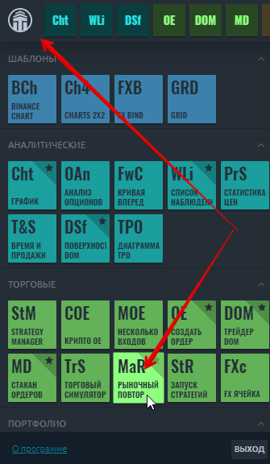
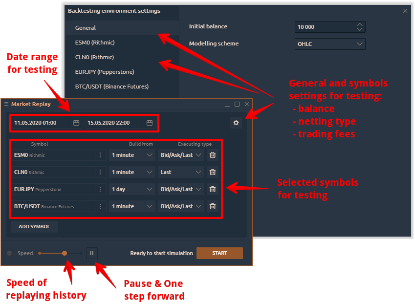
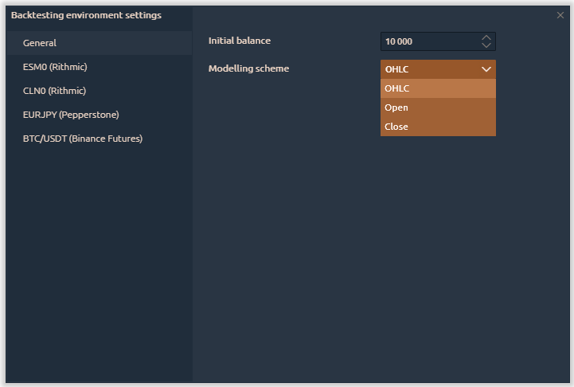
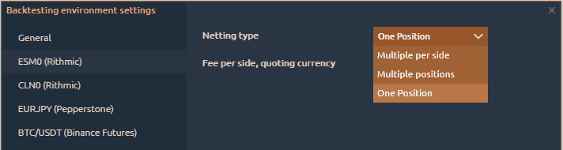
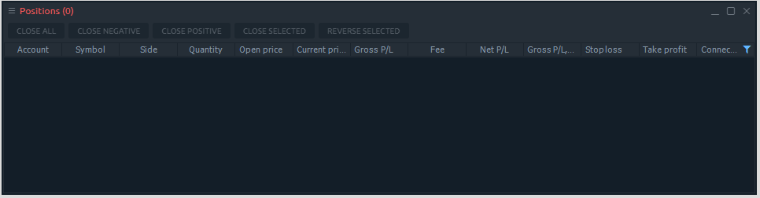
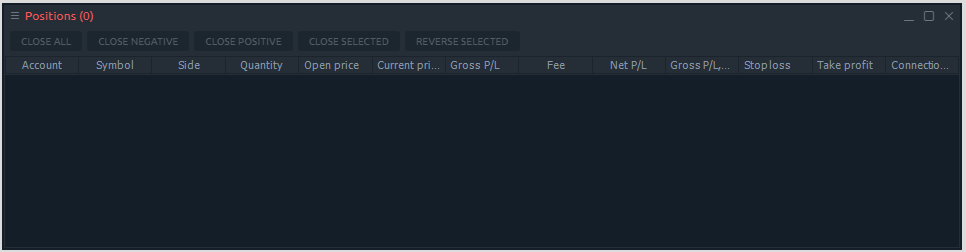

# Рыночный повтор

* \*\*\*\*[**Что такое рыночный повтор**](history-player.md#chto-takoe-rynochnyi-povtor)\*\*\*\*
* [**First launch of the Market Replay**](history-player.md#first-launch-of-the-market-replay)
* **\[**General and instruments settings_\]\(history-player.md\#general-and-instruments-settings\)_

## Что такое рыночный повтор

Тестирование торговых стратегий - один из важнейших и необходимых шагов для успешной торговли. Если вы опытный алгоритмический трейдер, то метод автоматического тестирования идеален, и вы можете использовать наше [Расширение для Visual Studio.](https://help.quantower.com.ru/quantower-algo/installing-visual-studio) Но, к сожалению, многие трейдеры не знают языка программирования, что затрудняет тестирование их стратегий.

Поэтому Quantower предоставляет панель **Рыночный повтор** \(или Повтор истории\) для простого ручного тестирования любой торговой стратегии.

Повтор истории позволяет вам тестировать на любых торговых инструментах с любым поставщиком или брокером. Это особенно полезно, когда у вас есть доступ к потоку данных, который не позволяет выполнять заказы \(каналы даты котировок, такие как IQFeed или криптобиржа\).



## Первый запуск Рыночного повтора

* **Запустите панель** **Рыночный повтор** из главного меню приложения
* Добавьте торговый инструмент для тестирования
* Установите тип данных - Тик, 1 минута, 1 день
* Установите тип исполнения - Last или Bid / Ask / Last
* Нажмите кнопку **«Пуск»**, чтобы начать тестирование.

В нашем блоге мы подробно показали [процесс ручного тестирования торговых стратегий с помощью панели Market Replay.](https://www.quantower.com/blog/software-for-manual-backtesting-a-brief-review-of-history-player-plugin)


Если вы нажмете кнопку «Стоп», весь процесс тестирования будет отменен.


После запуска тестирования вы можете открыть все необходимые панели для тестирования, нажав кнопку «Открыть панель».

![&#x41E;&#x442;&#x43A;&#x440;&#x43E;&#x439;&#x442;&#x435; &#x43D;&#x435;&#x43E;&#x431;&#x445;&#x43E;&#x434;&#x438;&#x43C;&#x44B;&#x435; &#x43F;&#x430;&#x43D;&#x435;&#x43B;&#x438;, &#x447;&#x442;&#x43E;&#x431;&#x44B; &#x441;&#x43E;&#x437;&#x434;&#x430;&#x442;&#x44C; &#x440;&#x430;&#x431;&#x43E;&#x447;&#x443;&#x44E; &#x43E;&#x431;&#x43B;&#x430;&#x441;&#x442;&#x44C; &#x434;&#x43B;&#x44F; &#x442;&#x435;&#x441;&#x442;&#x438;&#x440;&#x43E;&#x432;&#x430;&#x43D;&#x438;&#x44F; &#x43D;&#x430; &#x438;&#x441;&#x442;&#x43E;&#x440;&#x438;&#x438;.](../.gitbook/assets/market-replay-in-action.gif)

## General and instruments settings

Before you start testing the strategy, you need to set up an initial trading balance, a simulation \(or modeling\) scheme for downloaded data, a commission size for a trading instrument, and the netting type.

Strategy testing can be performed by one of three schemes to choose from:

* **OHLC** - in this mode the sequence is constructed only by the OHLC prices of the minute bars, the number of the generated control points is significantly reduced - hence, so is the testing time.
* **Open** - in this mode, all trades are opened at the opening price of the next bar. This mode is well suited for testing strategies, which process deals only at the opening of the bar and do not use pending orders, as well as StopLoss and TakeProfit orders.
* **Close** - in this mode, all trades are opened at the closing price of the current bar.


"Open" and “Close” modes have the fastest testing time, but they are not suitable for all of the trading strategies. Select the desired test mode based on the characteristics of the trading system.


Now let's look at the main settings of the selected trading instrument

In the **Netting type** section, you can choose the method by which to summarize existing and new positions:

* **One position** - it is possible to open one position for one instrument in one direction in this mode. If you previously opened a position to buy 1 lot, adding a position to sell 1 lot will close the previous position. New trades for buy will be summed by volume, and the entry price will be averaged.

* **Multiple per Side** - this mode allows you to open many different positions in one direction.  For example, opening several positions in the sequence, they will be opened separately. Opposite trades \(for sale\) will close them.

* **Multiple Positions** - each new trade will be opened as a separate item, including the opposite trades.

