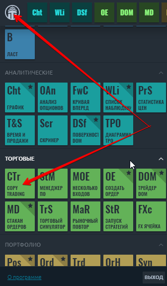
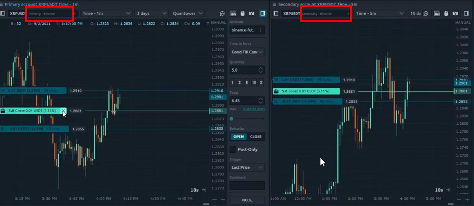
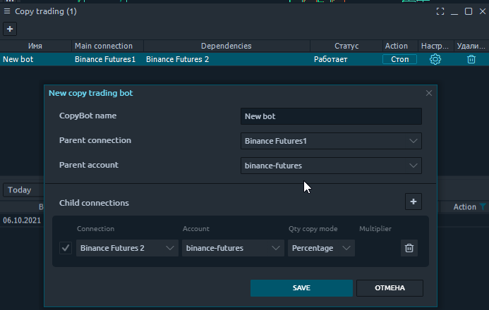
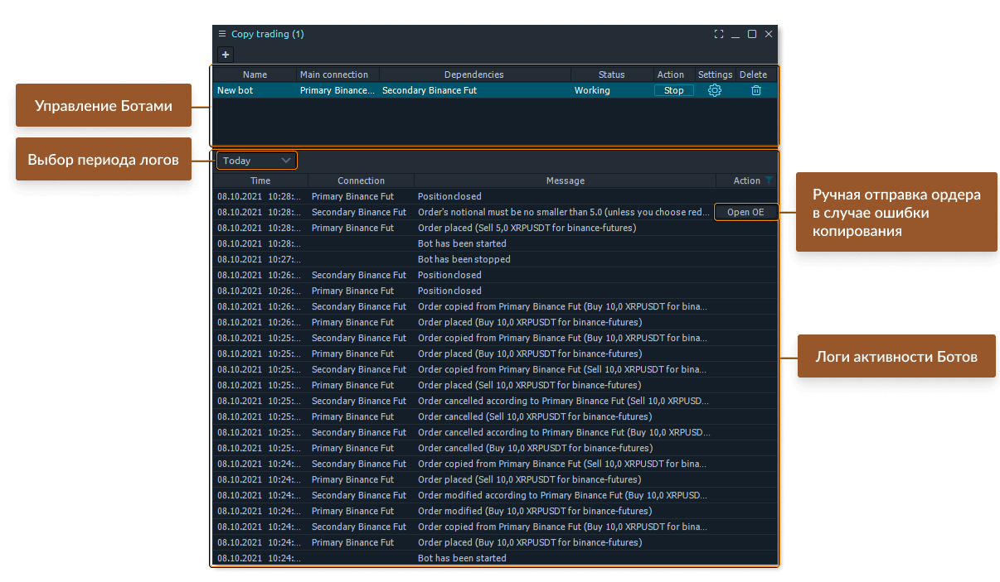
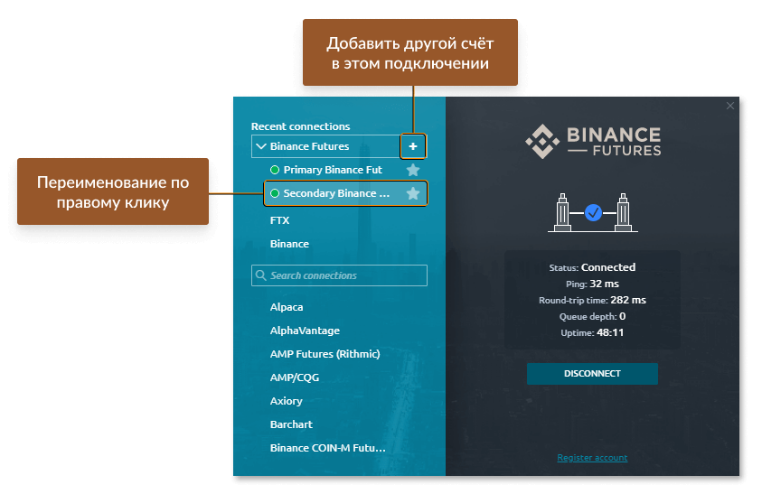
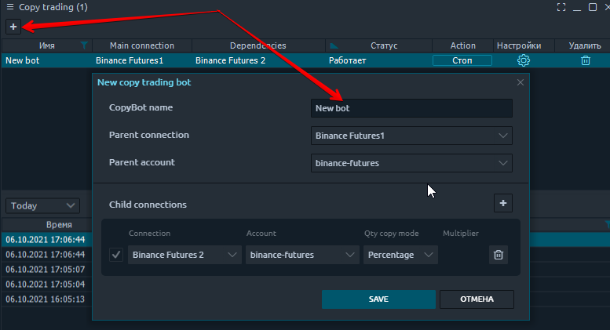
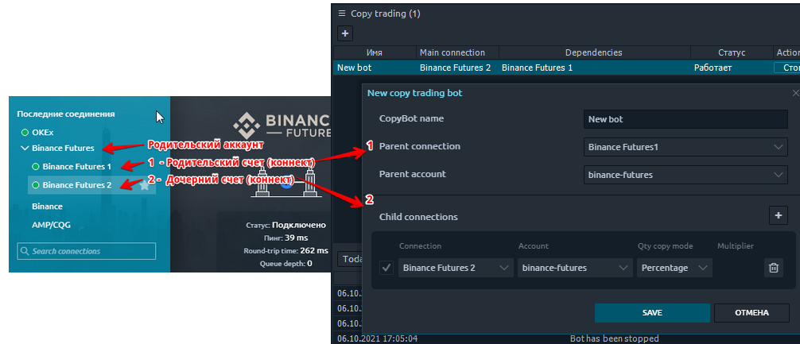
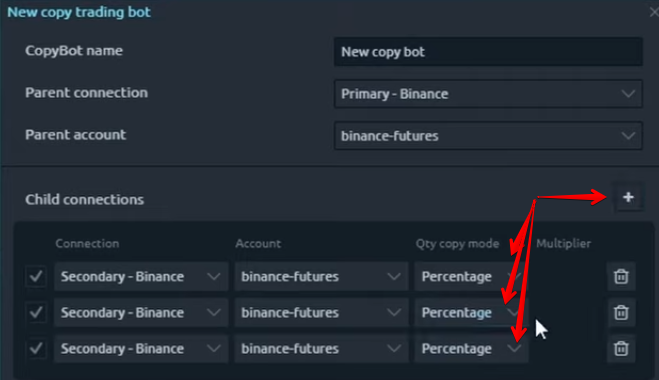
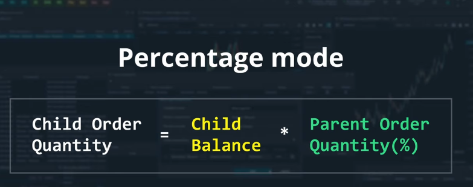
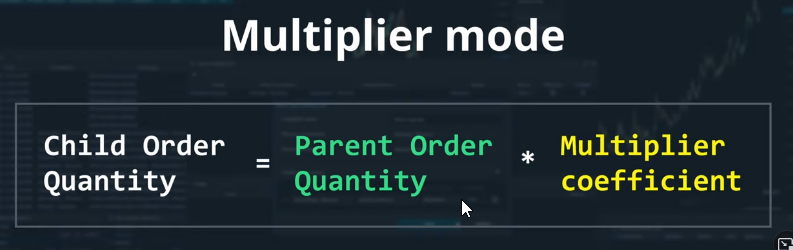

# Копирование сделок

Один из частых вопросов нашего сообщества: как копировать сделки между несколькими учетными записями? Такая функциональность может быть очень полезна для компаний, занимающихся проп-трейдингом и менеджеров с несколькими аккаунтами, которые используют Quantower в качестве своего торгового инструмента. 



* \*\*\*\*[**Как открыть панель "копирование сделок" и где она находится.**](kopirovanie-sdelok.md#kak-otkryt-panel-kopirovanie-sdelok-i-gde-ona-nakhoditsya)\*\*\*\*
* \*\*\*\*[**Как работает панель "копирование сделок" и в чем ее отличие от панели "Мультиордера"**](kopirovanie-sdelok.md#kak-rabotaet-panel-kopirovanie-sdelok-i-v-chem-ee-otlichie-ot-paneli-multiordera)\*\*\*\*
  * \*\*\*\*[**Верхняя часть - менеджер управления списком ботов для копирования торговли**](kopirovanie-sdelok.md#verkhnyaya-chast-menedzher-upravleniya-spiskom-botov-dlya-kopirovaniya-torgovli)\*\*\*\*
  * \*\*\*\*[**Нижняя часть - Журнал всех действий**](kopirovanie-sdelok.md#nizhnyaya-chast-zhurnal-vsekh-deistvii)\*\*\*\*
* \*\*\*\*[**Родительские и дочерние подключения**](kopirovanie-sdelok.md#roditelskie-i-dochernie-podklyucheniya)\*\*\*\*
* \*\*\*\*[**Создание  бота по копированию торговли**](kopirovanie-sdelok.md#sozdanie-bota-po-kopirovaniyu-torgovli)\*\*\*\*
* \*\*\*\*[**QTY copy mode - два режима для выбора объема торговли на дочерних счетах \(коннектах\)**](kopirovanie-sdelok.md#qty-copy-mode-dva-rezhima-dlya-vybora-obema-torgovli-na-dochernikh-schetakh-konnektakh)\*\*\*\*
  * \*\*\*\*[**Percentage - % на сделку от баланса пропорционально родительскому счету \(аккаунту\)**](kopirovanie-sdelok.md#rezhim-percentage-na-sdelku-ot-balansa-dochernego-scheta-na-sdelku-ot-balansa-roditelskogo-scheta)\*\*\*\*
  * \*\*\*\*[**Multiplier - множитель, К от сделки родительского счета**](kopirovanie-sdelok.md#multiplier-mnozhitel-k-ot-sdelki-roditelskogo-scheta)\*\*\*\*

### **Как открыть панель "копирование сделок" и где она находится.**

Панель относится к торговым панелям и ее можно найти в группе "торговые панели" в главном меню платформы, нажав на кнопку в верхнем левом углу.

### Как работает панель "копирование сделок" и в чем ее отличие от панели "Мультиордера"

Данная панель позволяет полностью автоматизировать сделки между мультиаккаунтами одного соединения по заранее созданному сценарию.   В отличии от панели  [**"Мультиордера"**](https://help.quantower.com.ru/trading-panels/multiple-order-entry)**,**  на данной панели единожды ****создав алгоритм для бота, сделки в дальнейшем будут полностью автоматически копироваться без участия трейдера  в указанный аккаунт при каждом совершенном трейде.

Бот копирования сделок будет работать только при активном подключении каждого счета. Если один из дочерних счетов не будет подключен в [**менеджере подключений**](https://help.quantower.com.ru/connections/connections-manager)**,** то копирование торговли  по этому счету не будут произведено.


Создать синхронизацию всех сделок можно только между аккаунтами одного соединения, биржи или брокера.

Панель "Копирование торговли" поддерживает следующие соединения: ["FTX"](https://help.quantower.com.ru/connections/connection-to-ftx), ["Binance", "Binance Futures",](https://help.quantower.com.ru/connections/connection-to-binance-futures) "Bitfinex", ["Rithmic",](https://help.quantower.com.ru/connections/connection-to-rithmic) ["Bybit", ](../connections/connection-to-bybit.md)"BitMEX",[ "Interactive Brokers"](https://help.quantower.com.ru/connections/connect-quantower-to-interactive-broker)

Если параметры ****ордера на родительском счете не может отправить дочерняя учетная запись по заданному условию, вы получите уведомление об этом и появится возможность вручную скопировать заказ, нажав кнопку «Открыть OE» рядом с этим сообщением в нижней части панели в журнале событий. Наиболее частая причина такого поведения - когда на Дочернем счете недостаточно средств для копирования нужного объема родительского ордера.


При этом можно наблюдать визуально полную синхронизацию сделок открыв одновременно два графика. Можно увидеть отображение тех сделок на графике, которые бот создает автоматически. Каждое передвижение позиций, SL/TP будет автоматически продублировано на второй коннект.  Отмена ордера на родительском счете так же приведет к отмене скопированного ордера на дочернем коннекте. 

#### **Панель "копирование сделок" разделена на две части:** 

#### **Верхняя часть - менеджер управления списком ботов для копирования торговли**

Это основная панель управления ботами для копирования торговли. Тут можно создавать новых ботов, останавливать и запускать выборочно ботов, настраивать параметры для каждого отдельного бота для копирования сделок. 

* **Имя бота** - каждому боту можно присвоить свое уникальное имя;
* **Родительский счет** **\(коннект\)**- название счета, на котором будет торговля;
* **Дочерний счет  \(коннект\)** - название счета, куда будут автоматически копироваться вся торговля;
* **Статус** - информативное поле, отображающее статус бота. Есть два статуса "Работает" и "Остановлено";
* **Действие** - активная кнопка для запуска и остановки ботов со списка;
* **Настройки** - шестеренка открывает настройки выбранного торгового бота;
* **Удалить** - удаление торгового бота.

#### **Нижняя часть - Журнал всех действий**

Все действия, которые были совершены по действующим ботам  будут показаны ****списком в виде журнала событий в нижней части панели. Включая информационные сообщения, такие как, "остановка" и "запуск" каждого бота. Таким образом можно контролировать каждое действие или событие совершенное ботами без участия трейдера.

Для поиска прошлых событий, при необходимости можно выбрать за период, используя фильтр указанный на изображении **"выбор периода логов".**

### Родительские и дочерние подключения

Чтобы добавить еще одну учетную запись для того же подключения в Quantower, вам следует перейти в [менеджер  подключений](https://help.quantower.com.ru/connections/connections-manager), продублировать необходимое подключение, при желании переименовать его и войти в систему с учетными данными другой учетной записи. Вы можете повторить это действие для добавления любого количества учетных записей.  При этом, вы увидите все эти учетные записи в настройках дочерних подключений.

1. **Родительский аккаунт -** это название соединения \(биржа, брокер\)
2. **Родительский счет \(коннект\)** - это аккаунт на котором будет совершаться основная торговля
3. **Дочерний счет \(коннект\)** - аккаунт или сразу несколько аккаунтов, куда будут копироваться все сделки.

### Создание бота по копированию торговли

Для создания нового торгового бота, кликните на кнопку "+"  в левой  верхнем углу панели.

**Введите имя бота**, что бы в дальнейшем в списке торговых ботов Вы могли легко определить и найти его.

Далее нужно выбрать  **родительский счет** \(коннект\) - это главный аккаунт на котором будет основная торговля. Родительский аккаунт - это название соединения, биржи , брокера где у вас есть несколько счетов. И добавить **дочерний счет** \(коннект\(ы\)\) - это аккаунты, куда будут копироваться вся торговля.

Каждая новая строка добавит еще счет, куда будут копироваться сделки

### QTY copy mode - два режима для выбора объема торговли на дочерних счетах \(коннектах\)

### **Режим Percentage - % на сделку от баланса дочернего счета = % на сделку от баланса родительского счета**


**-При выборе данного режима, размер ордера в % от баланса на дочерних счетах \(аккаунтах\) будет определяться автоматически.**  

**-% ордера от баланса дочернего счета будет равен  % ордера от баланса на родительском счете.** 


**Пример:**

Родительский счет имеет баланс 1000$ Сумма ордера 100$, что составляет 10% от баланса.  
Дочерний счет имеет баланс 2000$   
При размещении ордера на родительском аккаунте в размере 100$ \(10% от общего баланса\), будет автоматически размещен ордер на дочернем счете аналогично в размере 10% , что составит 200$.  
****

### Multiplier - множитель, К от сделки родительского счета

При выборе данного режима копирования торговли, необходимо ввести К - коэффициэнт от сделки на родительском счете. Каждая сделка на дочернем аккаунте будет открываться в размере сделки родительского счета умноженного на указанный К-коэффициэнт Multiplier.

**Пример:**

Сумма ордера на родительском счете **100$**, **К- 0,5**  
При размещении ордера на родительском аккаунте в размере 100$ , будет автоматически размещен ордер на дочернем счете с учетом К - 0,5, т.е. **100$\*0.5=50$**

Cумма ордера 100$, **К- 3**  
При размещении ордера на родительском аккаунте в размере 100$ , будет автоматически размещен ордер на дочернем счете  с учетом К - 3, т.е. **100$\*3=300$**


**Если на дочернем счете не хватит баланса для совершения сделки с указанным К, сообщение о ошибке можно увидеть в нижней части панели, в журнале событий.**


