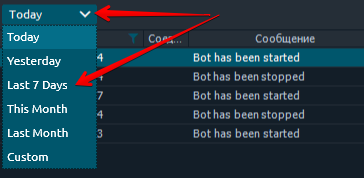

# Копирование сделок



* \*\*\*\*[**Как открыть панель "копирование сделок" и где она находится.**](kopirovanie-sdelok.md#kak-otkryt-panel-kopirovanie-sdelok-i-gde-ona-nakhoditsya)\*\*\*\*
* \*\*\*\*[**Как работает панель "копирование сделок" и в чем ее отличие от панели "Мультиордера"**](kopirovanie-sdelok.md#kak-rabotaet-panel-kopirovanie-sdelok-i-v-chem-ee-otlichie-ot-paneli-multiordera)\*\*\*\*
  * \*\*\*\*[**Верхняя часть - Список созданных алгоритмов \(ботов\)**](kopirovanie-sdelok.md#verkhnyaya-chast-spisok-sozdannykh-algoritmov-botov)\*\*\*\*
  * \*\*\*\*[**Нижняя часть - Журнал всех действий**](kopirovanie-sdelok.md#nizhnyaya-chast-zhurnal-vsekh-deistvii)\*\*\*\*
* \*\*\*\*[**Родительские и дочерние подключения**](kopirovanie-sdelok.md#roditelskie-i-dochernie-podklyucheniya)\*\*\*\*
* **Создание  бота по копированию торговли**

### **Как открыть панель "копирование сделок" и где она находится.**

Панель относится к торговым панелям и ее можно найти в группе "торговых панелей" в главном меню платформы, нажав на кнопку в верхнем левом углу.

### Как работает панель "копирование сделок" и в чем ее отличие от панели "Мультиордера"

Данная панель позволяет полностью автоматизировать сделки между мультиаккаунтами одного соединения по заранее созданному сценарию.   В отличии от панели  [**"Мультиордера"**](https://help.quantower.com.ru/trading-panels/multiple-order-entry)**,**  на данной панели единожды ****создав алгоритм для бота, сделки в дальнейшем будут полностью автоматически копироваться без участия трейдера  в указанный аккаунт при каждом совершенном трейде.


**\(!!!\) Создать синхронизацию всех сделок можно только между аккаунтами одного соединения, биржи или брокера.**

Панель "Копирование торговли" поддерживает следующие соединения: [**"FTX"**](https://help.quantower.com.ru/connections/connection-to-ftx)**,** [**"Binance", "Binance Futures"**,](https://help.quantower.com.ru/connections/connection-to-binance-futures) "Bitfinex", [**"Rithmic",**](https://help.quantower.com.ru/connections/connection-to-rithmic) ****[**"Bybit",** ](../connections/connection-to-bybit.md)"BitMEX",[ **"Interactive Brokers"**](https://help.quantower.com.ru/connections/connect-quantower-to-interactive-broker)\*\*\*\*


При этом можно наблюдать визуально полную синхронизацию сделок открыв одновременно два графика. Можно увидеть отображение тех сделок на графике, которые бот создает автоматически. Каждое передвижение позиций, SL/TP будет автоматически продублировано на второй коннект.

#### **Панель "копирование сделок" разделена на две части:** 

#### **Верхняя часть - Список созданных алгоритмов \(ботов\)**

Это основная панель управления ботами для копирования торговли. Тут можно создавать новых ботов, останавливать и запускать выборочно ботов, настраивать параметры для каждого отдельного бота для копирования сделок. 

* **Имя бота** - каждому боту можно присвоить свое уникальное имя;
* **Родительский счет** **\(коннект\)**- название счета, на котором будет торговля;
* **Дочерний счет  \(коннект\)** - название счета, куда будут автоматически копироваться вся торговля;
* **Статус** - информативное поле, отображающее статус бота. Есть два статуса "Работает" и "Остановлено";
* **Действие** - активная кнопка для запуска и остановки ботов со списка;
* **Настройки** - шестеренка открывает настройки выбранного торгового бота;
* **Удалить** - удаление торгового бота.

#### **Нижняя часть - Журнал всех действий**

Все действия, которые были совершены по действующим ботам  будут показаны ****списком в виде журнала событий в нижней части панели. Включая информационные сообщения, такие как, "остановка" и "запуск" каждого бота. Таким образом можно контролировать каждое действие или событие совершенное ботами без участия трейдера.

Для поиска прошлых событий, при необходимости можно выбрать за период, используя фильтр указанный на изображении.

### Родительские и дочерние подключения

1. **Родительский аккаунт -** это название соединения \(биржа, брокер\)
2. **Родительский счет \(коннект\)** - это аккаунт на котором будет совершаться основная торговля
3. **Дочерний счет \(коннект\)** - аккаунт или сразу несколько аккаунтов, куда будут копироваться все сделки.

### Создание бота по копированию торговли

Для создания нового торгового бота, кликните на кнопку "+"  в левой  верхнем углу панели.

**Введите имя бота**, что бы в дальнейшем в списке торговых ботов Вы могли легко определить и найти его.

Далее нужно выбрать  родительский счет \(коннект\) - это главный аккаунт на котором будет основная торговля. Родительский аккаунт - это название соединения, биржи , брокера где у вас есть несколько счетов. И добавить Дочерний счет \(коннект\(ы\)\) - это аккаунты, куда будут копироваться вся торговля.

  

