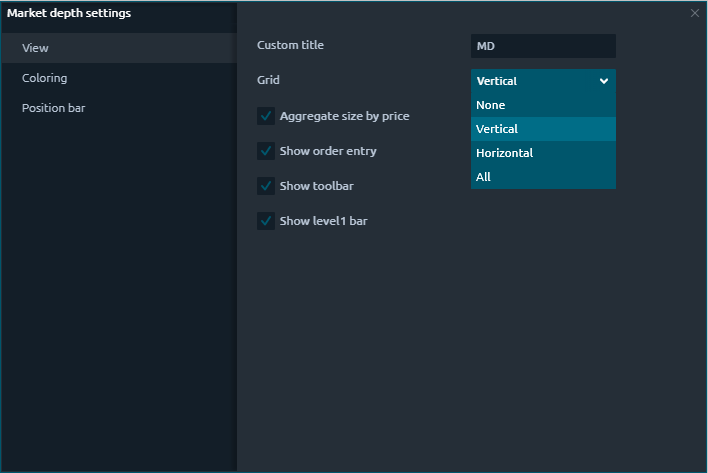
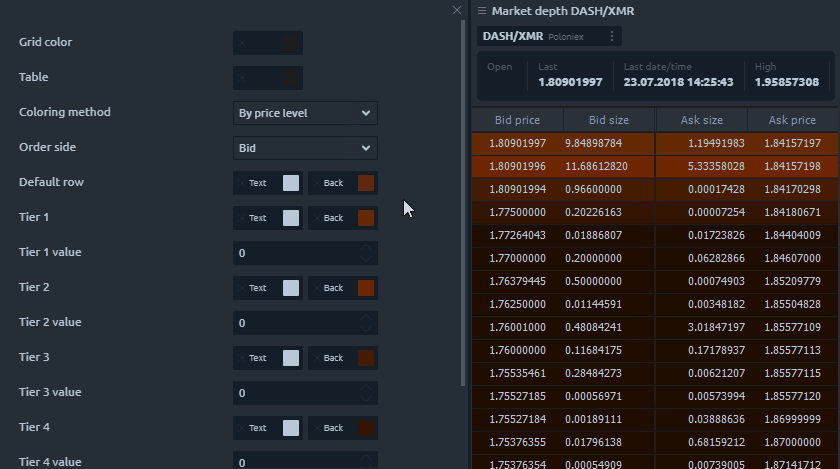
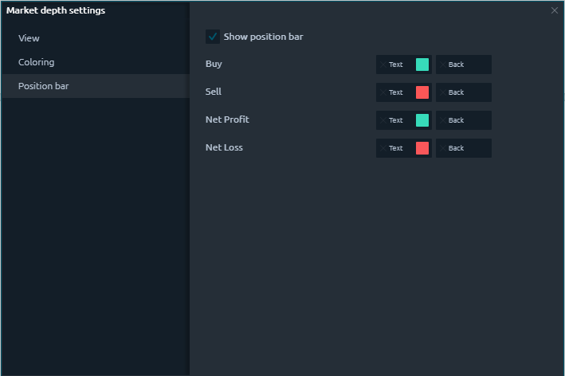

# Стакан ордеров

## Общая информация

Панель «Стакан ордеров» \(MD - Market depth\) позволяет просматривать количество открывающихся ордеров на покупку и продажу на разных ценовых уровнях для выбранного торгового инструмента. Благодаря этой панели вы можете лучше понять текущую ликвидность рынка и определить уроСтакан ордероввни спроса и предложения.

## Основные части панели стакана ордеров.

Панель стакана цен состоит из следующих частей:

1. **Ввод ордера,** где вы можете установить количество заказа и другие параметры перед его размещением.
2. **Инфо панель** - показывает рыночные данные по выбранному инструменту за текущую торговую сессию.
3. **Панель позиций** отображает краткую информацию об открытых позициях \(средняя цена открытия, количество и текущий P / L\)
4. **Дополнительные столбцы**, которые можно активировать для отображения расширенных рыночных данных

## Как торговать по стакану ордеров

Панель глубины рынка дает вам возможность быстро и безопасно вводить ордера по инструменту одним щелчком мыши. Используя ввод ордера для настройки ордера в стакане ордеров, вы можете выбрать счет, количество ордера, TIF и разместить ордер по рынку или по котировке Ask / Bid.

Чтобы выставить ордер в Стакане ордеров \(MD - Market depth\):

* Выберите учетную запись и ограничение заказа \(TIF\) в вводе заказа;
* Введите количество;
* Нажмите кнопку Bid, Ask или Market, чтобы разместить ордер;
* Подтвердите свое размещение, предварительно проверив все параметры.

## Настройки стакана цен

Additional settings of the market depth allow you to customize the appearance of the panel, set the custom name of the panel, and also set the color schemes of the table.

### View settings

* **Aggregate size by price.** Allows to merge Bid size and Ask size by the same price that came from different ECNs \(BATS, ARCA, IEX etc.\);
* **Show order entry.** This option shows/hides an Order Entry on the panel for quick order placement;
* **Show toolbar.** This option shows/hides the top toolbar with the trading symbol and expands the "useful" area of the panel. It is recommended to use this option with the symbol link;
* **Show Level 1.** Shows/hides the header pane, which contains Level 1 market data for the selected instrument.

### Coloring settings

The Market depth panel has different coloring methods for Level 2 quotes which allow you to adjust the colors according to the specified conditions.

* **By price level.** Coloring system by color levels depending on price tier;
* **Relative to volume.** Level 2 quotes are colored on the assumption that the max volume has the most saturated color;
* **Step to max volume.** Level 2 quotes are colored on the assumption that the max volume value which is set in the settings has the most saturated color. Here you can set Max volume value and pick the most saturated Ask and Bid colors.

### Position bar settings

At the bottom of the Market Depth is the Position Bar, which displays a brief info about an open position on the current trading instrument — the number of contracts, the average open price, current profit and loss.

