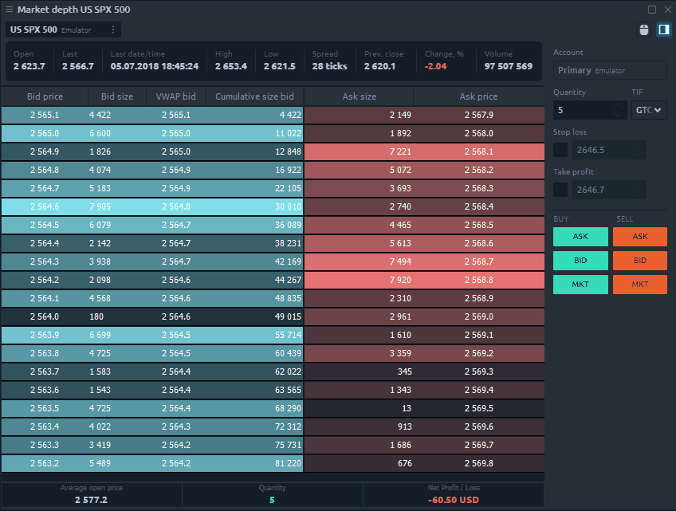
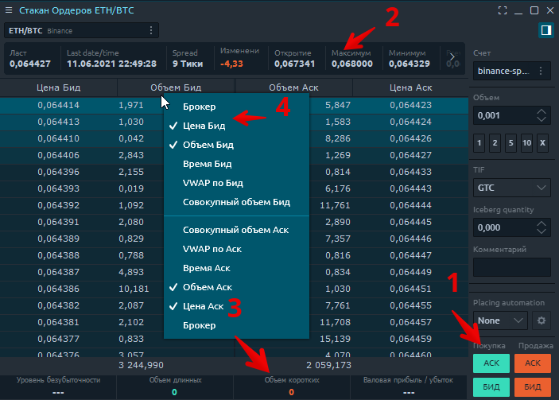
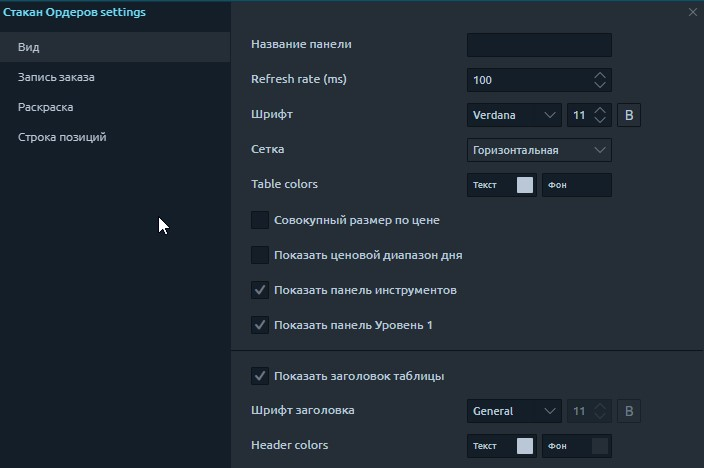
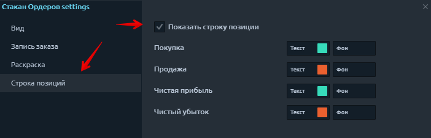

# Стакан ордеров

## Общая информация

Панель «Стакан ордеров» \(MD - Market depth\) позволяет просматривать количество открывающихся ордеров на покупку и продажу на разных ценовых уровнях для выбранного торгового инструмента. Благодаря этой панели вы можете лучше понять текущую ликвидность рынка и определить уровни спроса и предложения.

## Основные части панели стакана ордеров.

Панель стакана состоит из следующих частей:

1. **Ввод ордера,** где вы можете установить объем ордера и другие параметры перед его размещением.
2. **Инфо панель \(панель уровень 1\)** - показывает рыночные данные по выбранному инструменту за текущую торговую сессию.
3. **Строка позиций** отображает краткую информацию об открытых позициях \(средняя цена открытия, количество и текущий P / L\)
4. **Дополнительные столбцы**, которые можно активировать для отображения расширенных рыночных данных

## Как торговать по стакану ордеров

Панель глубины рынка дает вам возможность быстро и безопасно вводить ордера по инструменту одним щелчком мыши. Используя ввод ордера для настройки ордера в стакане ордеров, вы можете выбрать счет, количество ордера, TIF и разместить ордер по рынку или по котировке Ask / Bid.

Чтобы выставить ордер в Стакане ордеров \(MD - Market depth\):

* Выберите учетную запись и ограничение заказа \(TIF\) в вводе заказа;
* Введите количество;
* Нажмите кнопку Bid, Ask или Market, чтобы разместить ордер;
* Подтвердите свое размещение, предварительно проверив все параметры.

## Настройки стакана цен

Дополнительные настройки стакана цен позволяют настроить внешний вид панели, задать собственное имя панели, а также задать цветовые схемы таблицы.

### Просмотр настроек

* **Совокупный размер по цене.** Позволяет объединить размер Bid и Ask по той же цене, которая поступила из разных ECN \(BATS, ARCA, IEX и т. Д.\);
* **Показать ввод заказа.** Эта опция показывает / скрывает ввод ордера на панели для быстрого размещения ордера;
* **Показать панель инструментов.** Эта опция показывает / скрывает верхнюю панель инструментов с торговым символом и расширяет «полезную» область панели. Рекомендуется использовать эту опцию с символьной ссылкой;
* **Показать инфо панель \(панель уровень 1\)** Отображает / скрывает панель заголовка, содержащую рыночные данные для выбранного инструмента.

### Настройки оформления 

На панели стакана ордеров предусмотрены различные методы цветового оформления котировок, которые позволяют настраивать цвета в соответствии с заданными условиями.

* **По цене.** Система раскраски по уровням цвета в зависимости от ценового уровня;
* **По максимальному объему в стакане .** Котировки  раскрашены исходя из предположения, что максимальный объем имеет наиболее насыщенный цвет;
* **По указанному максимальному объему.** Котировки раскрашены исходя из предположения, что максимальное значение объема, установленное в настройках, имеет наиболее насыщенный цвет. Здесь вы можете установить значение максимального объема и выбрать наиболее насыщенные цвета Ask и Bid.

### Настройка строки позиций

Внизу стакана цен находится строка позиции, на которой отображается краткая информация об открытой позиции по текущему торговому инструменту - количество контрактов, средняя цена открытия, текущая прибыль и убыток.

