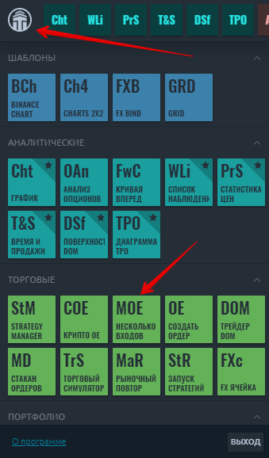

# Ввод мульти-ордеров

Панель ввода мульти-ордеров позволяет создавать заранее определенный список ордеров для разных символов, счетов, подключений, объединять их в группы, изменять их параметры и, самое главное, размещать их на рынке.



Чтобы открыть новую панель ввода множественных ордеров, перейдите в главное меню \(значок с логотипом\) и выберите «Несколько входов» \(MOE\) в разделе «Торговля».

