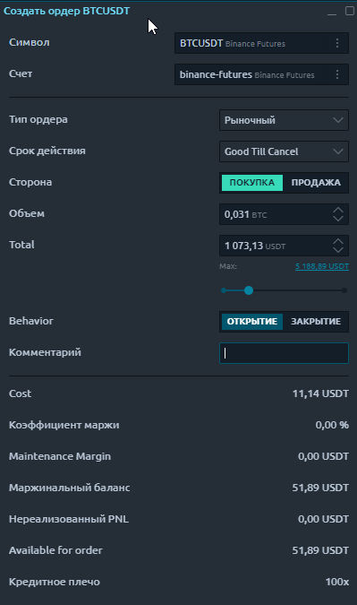
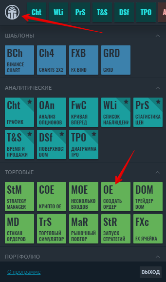
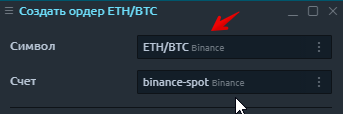
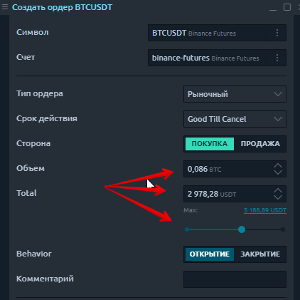
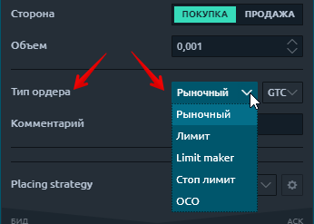
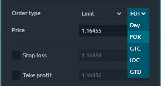
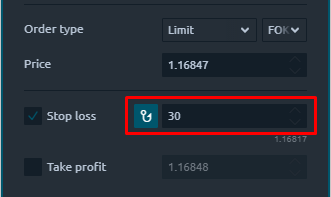
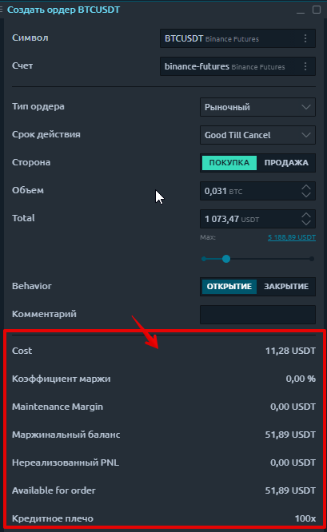
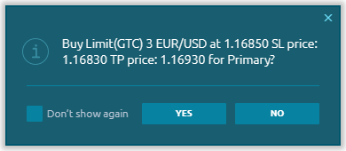
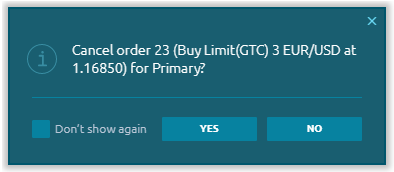

# Панель OE (Ввод ордера)

* ****[**Общая информация**](./#obshaya-informaciya)****
* ****[**Как открыть панель ввода заказов?**](./#kak-otkryt-panel-vvoda-zakazov)****
* ****[**Выбор символа и счета**](./#vybor-simvola-i-scheta)****
* ****[**Ввод объема ордера** ](./#vvod-obema-ordera)****
* ****[**Типы заказов и ограничения**](./#tipy-zakazov-i-ogranicheniya)****
* ****[**Защита ордера**](./#zashita-ordera)****
* ****[**Подтверждение заказа**](./#podtverzhdenie-zakaza)****
* ****[**Ввод ордера для CQG подключения**](https://help.quantower.com.ru/trading-panels/order-entry/order-entry-for-cqg)****
* ****[**Ввод ордера для Bybit**](https://help.quantower.com.ru/trading-panels/order-entry/vvod-ordera-dlya-bybit)****
* Order Entry for Rithmic connection
* Order Entry for Binance Futures

## Общая информация

Панель ввода ордеров позволяет создавать торговые ордера с различными условиями, такими как количество ордеров, цена, сторона, тип ордера, и отправлять их на рынок. На панели ввода заказа вы можете предоставить всю необходимую информацию для заказа и легко отправить ее, нажав соответствующую кнопку действия.

Вся панель условно разделена на несколько зон:

* выбор торгового инструмента и торгового счета;
* установка необходимого количества заказа и стороны заказа (Купить или Продать);
* выбор типа заявки, ее цены и условия TIF;
* блок с информацией о балансе;
* установка цен стоп-лосс и тейк-профит;
* информация о текущих ценах Ask и Bid, размере спреда, ценах VWAP, а также кнопка размещения ордера.

## Как открыть панель ввода заказов?

Откройте главное меню, щелкнув логотип, и в разделе **«Торговые»** щелкните значок OE.

## Выбор символа и счета

Выбор торгового инструмента можно выполнить вручную через Поиск символов или [привязав панель к другим панелям](https://help.quantower.com.ru/general-settings/binds), например, к графику. Просто выберите один цвет ссылки на двух панелях, и у них будет параметр [синхронизированного символа](https://help.quantower.com.ru/general-settings/link-panels).


В зависимости от выбранного подключения и торговой пары, панель ввода ордера автоматически перечислит и покажет все поддерживаемые данным коннектом типы ордеров и условия, доступные для связанного инструмента при выбранном соединении.&#x20;


Если в вашем подключении доступно несколько торговых счетов, вы можете выбрать необходимую учетную запись, нажав кнопку «Выбрать учетную запись».

## **Ввод объема ордера**&#x20;

**Ввести объем ордера можно** указав количество в валюте котировки и в процентах от доступной маржи. Сделать это можно, как описано ниже, тремя способами на выбор:

* ввести нужное количество монет/лотов исходя из выбранной торговой пары;
* ввести общую сумму ордера. Это поле крайне удобно, когда нужно быстро указать сумму входа в сделку сразу в валюте баланса, не пересчитывая при этому количество монет по курсу;
* выбрать ползунком сумму ордера в % от общего максимального доступного баланса с учетом установленного кредитного плеча.


Данный функционал действует только в тех подключениях, где биржа/брокер предоставляет такую возможность.&#x20;


## Типы заказов и ограничения

Ввод ордеров автоматически перечисляет все поддерживаемые обменом типы ордеров, доступные для связанного инструмента при выбранном соединении. В рамках существующих подключений мы поддерживаем:

* **Рыночный ордер** - это ордер, размещаемый без цены с намерением получить лучшую ставку или лучшее предложение, доступное в настоящее время на рынке. Ордер исполняется по текущей лучшей цене.
* **Лимитный ордер** позволяет выставить ордер по определенной лимитной цене или лучше.
* **Стоп-ордер** позволяет подать рыночный ордер на покупку или продажу, если и когда будет достигнута цена срабатывания стоп-сигнала.\
  \
  В каждом подключении могут быть свои особенные типы ордеров, доступные именно для выбранного соединения.

Параметры **Time-in-Force (TIF)** определяют продолжительность времени, в течение которого ордер будет продолжать работать, прежде чем он будет отменен. В рамках существующих подключений мы поддерживаем множество **TIF:**

* **DAY** - ордер будет отменен, если он не будет исполнен в течение текущего торгового дня;
* **FOK** (или Fill or Kill) - ордер будет отменен, если он не будет исполнен в полном объеме, как только он станет доступен;
* **Ордера GTC** (действительны до отмены) будут работать до тех пор, пока они не будут отменены трейдером или не истечет срок действия контракта;
* **IOC** (Немедленно или отменить) требует, чтобы любая часть ордера, которая не была исполнена, как только она становится доступной на рынке, была отменена;
* **Ордер GTD** (Действителен до даты) будет продолжать работать в системе и на рынке до тех пор, пока он не будет выполнен или до закрытия рынка в указанную дату.


Список TIF может быть разным в зависимости от подключения, типа заказа или типа инструмента!


## Защита ордера

Чтобы защитить позицию от значительного убытка, вы можете использовать ордера **Stop Loss**. Для этого активируйте флажок **«Stop Loss»** и укажите цену, по которой ордер будет закрыт.

Как только позиция станет прибыльной, вы можете изменить цену Stop Loss до уровня безубыточности. Для автоматизации этого процесса был создан трейлинг-стоп. Этот инструмент особенно полезен, когда цена сильно меняется в одном направлении или когда по какой-то причине невозможно постоянно наблюдать за рынком.

Для получения прибыли можно использовать ордер **Take Profit**, который автоматически закроет позицию по указанной цене. Для этого активируйте флажок «**Take Profit»** и укажите цену, по которой ордер будет закрыт.


**Стоп-лосс ордер** можно установить:

* для длинных позиций ниже текущей цены
* для коротких позиций выше текущей цены

**Ордер Take Profit** можно установить:

* для длинных позиций выше текущей цены
* для коротких позиций ниже текущей цены


## **Блок информации о балансе.**

Блок информации о балансе позволяет не заходя в панель "информация о счете", увидеть необходимую информацию о балансе сразу при вводе ордера.&#x20;

## Подтверждение заказа

После того, как вы установили все необходимые параметры заказа и нажали кнопку РАЗМЕСТИТЬ ЗАКАЗ, появится экран подтверждения заказа.

Это окно содержит сводную информацию о вашем ордере, которая позволит вам проверить правильность введенных данных - тип ордера, торговый инструмент, цена, количество, цены тейк-профита и стоп-лосса.


Если вы активируете флажок **«Больше не показывать»**, подтверждение не будет отображаться, и заказ будет немедленно отправлен в книгу заказов. Для того, чтобы эти уведомления возвращались, необходимо в Общих настройках приложения установить флажок **«Подтвердить размещение заказа».**

