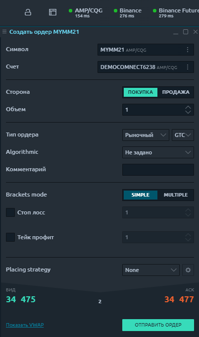

# Ввод ордера для CQG

Общий вид панели ввода заказов для подключения CQG выглядит следующим образом и разделен на следующие категории:

* Выбор счета и символа
* Направление ордера и его количество
* Параметры ордера - тип, TIF, цена, алгоритмические настройки
* Режим для стоп-лосса и тейк-профита. Мульти-кронштейны
* Стратегии размещения заказов

## Типы заказов CQG, время действия \(TIF\), алгоритм в Quantower

CQG предоставляет различные типы ордеров для торговли через панель ввода ордеров:

* Рыночный порядок
* Лимитный ордер
* Стоп-ордер
* Стоп-лимитный ордер

**Праметры Time-in-Force \(TIF\)** определяют продолжительность времени, в течение которого ордер будет продолжать работать, прежде чем он будет отменен. CQG предоставляет различные TIF:

* GTC \(Годен до отмены\) - ордера будут работать до тех пор, пока они не будут отменены трейдером или не истечет срок действия контракта;
* FOK \(или Fill or Kill\) - ордер будет отменен, если он не будет исполнен в полном объеме, как только он станет доступен;
* IOC \(Немедленно или отменить\) - требует, чтобы любая часть ордера, которая не была исполнена, как только она становится доступной на рынке, была отменена;
* ДЕНЬ - ордер будет отменен, если он не будет исполнен в течение текущего торгового дня;
* GTD \(Действителен до даты\) - ордер будет продолжать работать в системе и на торговой площадке до тех пор, пока он не исполнится или до закрытия рынка в указанную дату.
* GTT \(Действителен до времени\) - ордер, который остается открытым до указанного времени. В это время все невыполненные лоты аннулируются.
* FAK \(Fill and Kill\) - заказы требуют отмены любого количества, оставшегося после частичного заполнения.
* ATC \(At the Close Order\) - приказ на покупку или продажу акции по цене закрытия. Одним из преимуществ этого типа ордера является то, что его можно разместить до фактического окончания запрошенного торгового дня. Это было бы противоположностью открытого ордера.
* ATO \(At-The-Open Order\) - приказ на покупку или продажу акции по цене открытия. Заказ АТО разрешен во время предоткрытых сессий \(утром и днем\) или даже накануне вечером.

