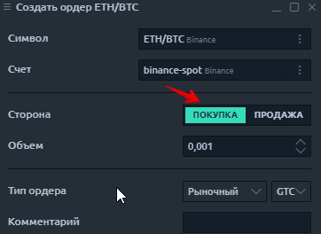

# Типы ордеров

Типы ордеров позволяют указать, как будет вести себя ордер при входе на рынок. Например, вы можете захотеть, чтобы ордер немедленно исполнялся по текущей лучшей цене \(рыночный ордер\) или исполнялся только по определенной цене \(лимитный ордер\).

Типы заказов отличаются от ограничений заказов, которые определяют, как заказ ведет себя во время сеанса. Например, заказ может быть удален, если не исполнен до конца сеанса \(День\), или может существовать до исполнения или отмены \(GTC\).

Ордера можно разделить на 2 группы:

* **Ордер на покупку,** открывающий длинную позицию, отправляется, если трейдер верит в дальнейший рост актива;

  **Ордер на продажу**, который открывает короткую позицию, отправляется, если трейдер верит в дальнейшее снижение актива.

Quantower поддерживает следующие типы заказов:

* Рыночный
* Лимитный
* Стоп лимит

Доступные виды заказа могут отличаться при разных соединениях в зависимости от предустановленных параметров выбранного подключения.

