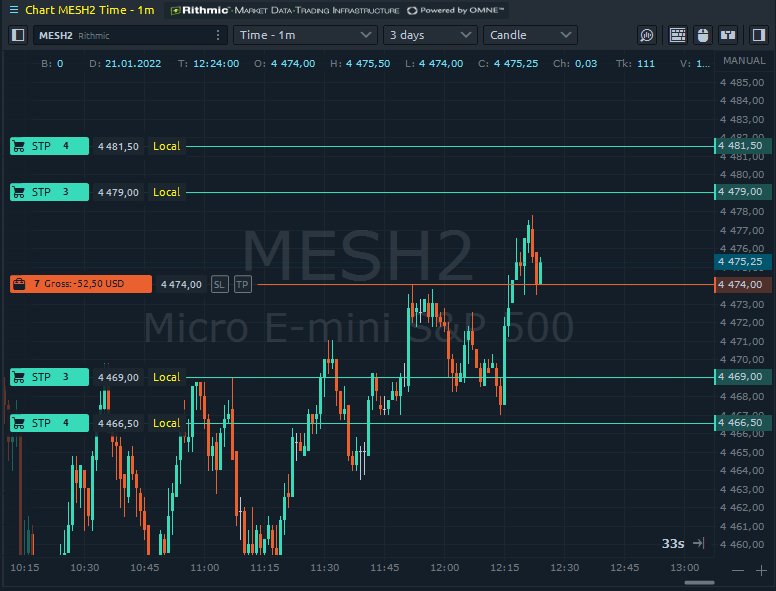

# Локальные SL/TP

## **Перед использованием в реальной торговле**

Данный функционал реализован в Quantower с помощью “Стратегий отправки ордеров”, а значит все локальные ордера обрабатываются исключительно на стороне платформы (буквально «на вашем компьютере»). Такое поведение приводит к некоторым важным правилам и ограничениям, которые пользователи должны понимать перед использованием локальных закрывающих ордеров:


<mark style="color:orange;">**Мы настаиваем на том, чтобы вы прочитали, потренировались и поняли как работают локальные закрывающие ордера, прежде чем использовать их для реальной торговли.**</mark>



**Локальные ордера SL/TP существуют и управляются на стороне платформы («на вашем компьютере»).**



**Когда вы закроете платформу, она **<mark style="color:red;">**навсегда удалит ВСЕ локальные ордера SL/TP**</mark>**.**



**Когда ваша платформа потеряет соединение, она **<mark style="color:red;">**безвозвратно удалит все локальные ордера SL/TP, связанные с этим соединением**</mark>** и вы не сможете восстановить их после повторного подключения.**



**Пожалуйста, не используйте кнопки **<mark style="color:blue;">**Reverse**</mark>** и **<mark style="color:blue;">**Breakeven**</mark>** с ордерами и позициями, содержащими ордера Local SL/TP, чтобы избежать неожиданного поведения.**


## Как использовать локальный SL/TP?

Чтобы добавить локальные ордера Стоп-лосс и Тейк-профит, вам нужно найти элемент управления “Автоматизация отправки” в любой форме создания ордера (отдельная панель или боковые панели) и выбрать опцию «Локальный SL/TP». Во время первого выбора платформа уведомит вас о необходимости ознакомиться с документацией по этой функции и согласиться с рисками для торговли, которые могут возникнуть.

 (1).png>)

Далее следует открыть сеттинги Local SL/TP и настроить их по своему усмотрению.

 (1).png>)

Здесь вы найдете следующие параметры:

* **Тип цены ордеров** (относительно родительской цены). \
  Смещение в тиках, процентах или ​​абсолютное значение цены. Указывает в каких значениях должна быть установлена ​​цена закрывающих ордеров.&#x20;
* **Тип закрывающих ордеров.**\
  ****Какие ордера следует отправлять на закрытие — Стоп или Лимит (полезно для некоторых криптобирж, для снижения комиссий)
* **Режимы отправки ордеров.**\
  ****Простой SL/TP или Многоуровневый (до 3 уровней). Различные схемы отправки.
* **Количество закрытия.**\
  ****Опция для режима Простой SL/TP, указывающая, как должна вести себя активная локальная SL/TP, когда соответствующий родительский ордер/позиция меняет свое количество. С опцией «Вся позиция» стратегия попытается изменить ордера закрытия. При выборе “Изначальный объем” стратегия не будет изменять объем у локальных стоп ордеров.
* **Трейлинг.**\
  ****Возможность сделать простой SL или TP трейлингом (изменяющимся в процессе движения цены)
* **Уровень 1, 2, 3.**\
  ****Уровни закрытия для Многоуровневой схемы. Вам необходимо активировать уровень и задать параметры его закрытия.

Как только вы закончите настройку Local SL/TP, просто закройте экран настроек и отправьте ордер как обычно. В случае каких-либо неверных параметров платформа сообщит вам в уведомлениях.

Локальные ордера также являются родитель-зависимыми, а это означает, что каждый раз, когда вы закрываете родительский ордер/позицию, он автоматически отменяет связанные локальные ордера.

## Где отслеживать стратегии отправки?&#x20;

Вы можете отслеживать свои активные стратегии для локальных SL/TP панели [“Стратегии отправки ордеров”](./). Здесь Вы найдете все стратегии автоматического размещения ордеров со статусами и журналами активности. Также Вы можете остановить любую активную стратегию, которая, в случае локального SL/TP, удалит стоп-ордера, но не соответствующий родительский ордер или позицию.&#x20;

Обратите внимание, что любой локальный ордер будет иметь метку _**«Локальный»**_ рядом с ним во всех местах, где он отображается визуально. Эта метка является основным идентификатором, который должен помочь вам различить их среди обычных серверных ордеров.&#x20;

.png>)

## Использование одновременно с нативными SL/TP брокера&#x20;

Хотя трейдер может использовать функциональность локальных ордеров с соединениями, которые изначально поддерживают ордера SL/TP, <mark style="color:orange;">**мы настоятельно рекомендуем избегать их смешивания**</mark>. Платформа будет отображать предупреждающее сообщение каждый раз, когда вы пытаетесь использовать оба типа стоп-ордеров одновременно.
