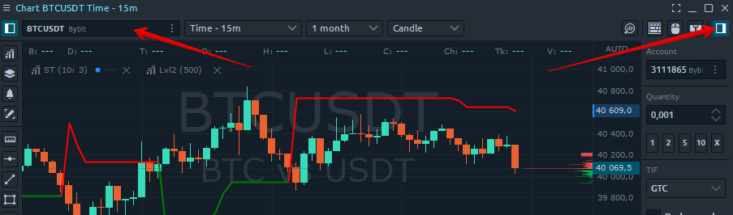
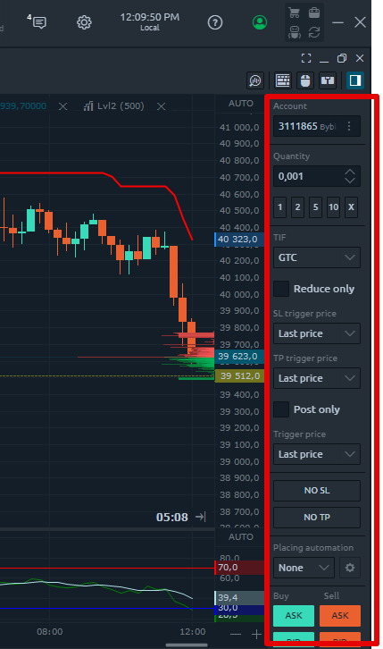
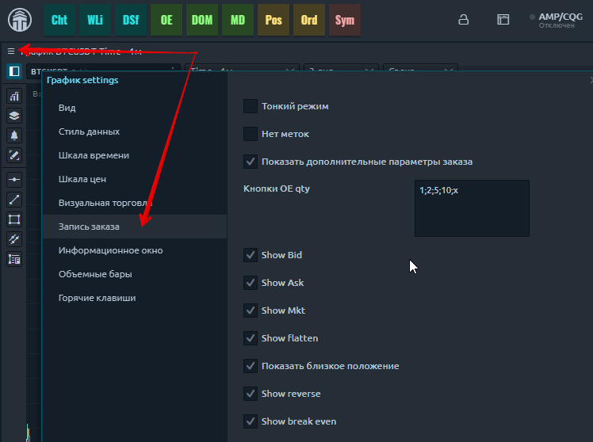
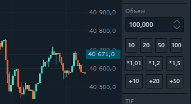
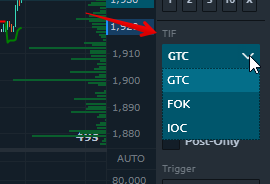
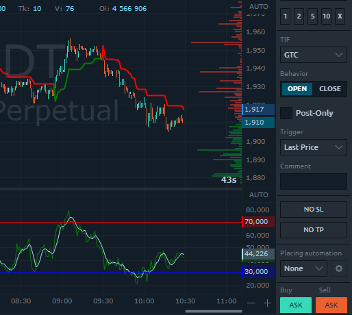

# Ввод ордера для Bybit

**Bybit -** биржа для торговли бессрочными  деривативныи контрактами на криптовалюты с маржинальным плечом до х100**.** Минимальный контракт от 1$

**Ввод ордеров** на платформе Quantower можно осуществлять разными вариантами, в зависимости от выбранного стиля торговли:

* с панели быстрого ввода ордеров с графика \(для криптовалютных подключений так же с [панели ввода крипто-ордера\)](https://help.quantower.com.ru/trading-panels/crypto-order-entry)
* торговый режим мышью, быстрое размещения ордеров [через область графика с помощью мыши](https://help.quantower.com.ru/analytics-panels/chart/general-overview#verkhnyaya-panel-instrumentov-grafika)
*  путем настройки и торговли с [горячих клавиш. ](https://help.quantower.com.ru/analytics-panels/chart/chart-settings#goryachie-klavishi)

Ниже мы рассмотрим как создать ордер на бирже **Bybit** с панели быстрого ввода ордеров с графика. Прежде, чем это сделаем, убедитесь что вы успешно [**подключились к бирже Bybit,**](https://help.quantower.com.ru/connections/connection-to-bybit) ****и выбрали торговую пару с данного соединения.

Панель инструментов [**быстрой торговли с графика**](https://help.quantower.com.ru/analytics-panels/chart/chart-trading) **Bybit**  можно открыть, как указано на рисунке ниже:

###  **Общий вид панели ввода** заказов

Общий вид панели ввода заказов для подключения **Bybit** выглядит следующим образом и разделена на следующие категории:

* Выбор счета и символа
* Сумма заказа ордера и выбор направления
* Параметры ордера - тип, TIF, цена, алгоритмические настройки.
* Режим для стоп-лосса и тейк-профита. 
* Параметры размещения ордера \(стратегия\)

**Сумма заказа ордера** 

Кнопки быстрого изменения суммы заказа помогут в один клик изменить указанный объем исходя из Вашей стратегии торговли. Вы можете установить по умолчанию любые параметры, которые Вам необходимы для быстрого изменения значений. Причем, кнопки могут изменять не только на заданный объем позиции, но и применять свои любые \(!!!\) формулы для расчета объема ордера.  Для установки персональных значений для быстрого изменения ордера, необходимо перейти в настройки графика в раздел меню [**"Запись заказа"**](https://help.quantower.com.ru/analytics-panels/chart/chart-settings#vvod-ordera) и найти поле "кнопки OE"

Вы можете установить стандартные значения суммы ордера, которые  соответствует вашим рискам. Это очень удобно для ручной торговли.

![&#x41A;&#x43D;&#x43E;&#x43F;&#x43A;&#x438; &#x43C;&#x43E;&#x433;&#x443;&#x442; &#x438;&#x437;&#x43C;&#x435;&#x43D;&#x44F;&#x442;&#x44C; &#x43D;&#x435; &#x442;&#x43E;&#x43B;&#x44C;&#x43A;&#x43E; &#x43D;&#x430; &#x437;&#x430;&#x434;&#x430;&#x43D;&#x43D;&#x44B;&#x439; &#x43E;&#x431;&#x44A;&#x435;&#x43C; &#x43F;&#x43E;&#x437;&#x438;&#x446;&#x438;&#x438;, &#x43D;&#x43E; &#x438; &#x43F;&#x440;&#x438;&#x43C;&#x435;&#x43D;&#x44F;&#x442;&#x44C; &#x43B;&#x44E;&#x431;&#x44B;&#x435; &#x444;&#x43E;&#x440;&#x43C;&#x443;&#x43B;&#x44B;](../../.gitbook/assets/zapis-zakaza-izmenenie-knopok.png)

### Параметры ордера - тип, TIF, цена, алгоритмические настройки

**Праметры Time-in-Force \(TIF\)** определяют продолжительность времени, в течение которого ордер будет продолжать работать, прежде чем он будет отменен.  **Bybit** предоставляет различные TIF:

* GTC \(Годен до отмены\) - ордера будут работать до тех пор, пока они не будут отменены трейдером или не истечет срок действия контракта;
* FOK \(или Fill or Kill\) - ордер будет отменен, если он не будет исполнен в полном объеме, как только он станет доступен;
* IOC \(Немедленно или отменить\) - требует, чтобы любая часть ордера, которая не была исполнена, как только она становится доступной на рынке, была отменена;

### Post-Only 

 [П](https://help.bybit.com/hc/en-us/articles/360039749433)ри отмеченном параметре «Post-Only », ордер  исполняется не как операция тейкера, и поэтому при его исполнении зарабатывается вознаграждение мейкера. Ордер «Post-Only » отменяется автоматически, если его можно исполнить немедленно против существующего на рынке ордера.

### Reduce-Only

Используется для сокращения размера позиции и не увеличивает ее размер.

### **TP \(тейк-профит\) и SL стоп лимит \(стоп-лосс\) ордера** 

 Биржа Bybit позволяет пользователям еще до открытия  сделки просчитать возможные риски и пользователи могут выставить свои цели – **TP** \(тейк-профит\) и ограничить убытки **SL** ордером \(стоп-лосс\), одновременно с установкой ордера на вход в позицию.

Для этого на панели ввода ордера одновременно с установкой ордера, Вы можете сразу задать нужные параметры **TP**  и **SL** 

После размещения позиции, **TP**  и **SL** можно изменять по ситуации прямо с графика путем перемещения мышкой на новые уровни:

\*\*\*\*

Далее идет большой блок **функций для управления текущей позицией**. Вы можете удалять или ограничивать ордера или стопы. Вы также можете перевернуть свою позицию с помощью одной кнопки или установить без потерь. Это очень функциональные кнопки, не пропустите их.

_Более детальные настройки с торговыми примерами и дополнительными условиями в разделе самой биржи ByBit_ [_"исполнение заказа_ ](https://help.bybit.com/hc/en-us/sections/900000849226-Order-Execution)_"_

  

