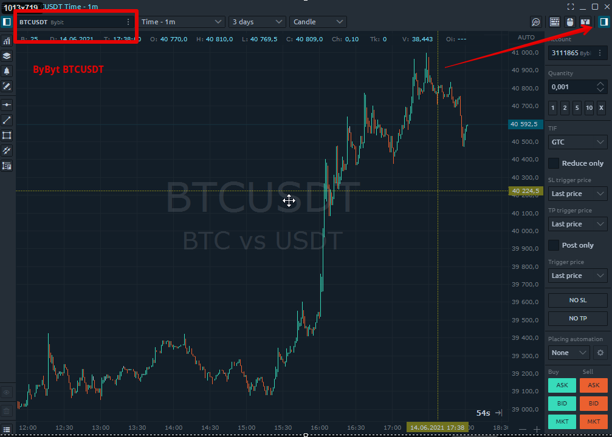
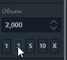

# Ввод ордера для Bybit

  
**Bybit -** биржа для торговли бессрочными  деривативныи контрактами на криптовалюты с маржинальным плечом до х100**.** Минимальный контракт от 1$

Ниже мы рассмотрим как создать ордер на бирже **Bybit** с панели быстрого ввода ордеров с графика. Прежде, чем это сделаем, убедитесь что вы успешно [**подключились к бирже Bybit,**](https://help.quantower.com.ru/connections/connection-to-bybit) ****и выбрали торговую пару с данного соединения.

Панель инструментов [**быстрой торговли с графика**](https://help.quantower.com.ru/analytics-panels/chart/chart-trading) **Bybit**  можно открыть, как указано на рисунке ниже:

###  **Общий вид панели ввода** заказов

Общий вид панели ввода заказов для подключения **Bybit** выглядит следующим образом и разделена на следующие категории:

* Выбор счета и символа
* Сумма заказа ордера и выбор направления
* Параметры ордера - тип, TIF, цена, алгоритмические настройки
* Режим для стоп-лосса и тейк-профита. 
* Параметры размещения ордера \(стратегия\)

**Сумма заказа ордера** 

Кнопки быстрого изменения суммы заказа помогут в один клик изменить указанный объем исходя из Вашей стратегии торговли. Вы можете установить по умолчанию любые параметры, которые Вам необходимы для быстрого изменения значений. Причем, кнопки могут изменять не только на заданный объем позиции, но и применять свои любые \(!!!\) формулы для расчета объема ордера.

Для установки персональных значений для быстрого изменения ордера, необходимо перейти в настройки графика в раздел меню [**"Запись заказа"**](https://help.quantower.com.ru/analytics-panels/chart/chart-settings#vvod-ordera) и найти поле "кнопки OE"

Вы можете установить стандартные значения суммы ордера, которые  соответствует вашим рискам. Это очень удобно для ручной торговли.

![&#x41A;&#x43D;&#x43E;&#x43F;&#x43A;&#x438; &#x43C;&#x43E;&#x433;&#x443;&#x442; &#x438;&#x437;&#x43C;&#x435;&#x43D;&#x44F;&#x442;&#x44C; &#x43D;&#x435; &#x442;&#x43E;&#x43B;&#x44C;&#x43A;&#x43E; &#x43D;&#x430; &#x437;&#x430;&#x434;&#x430;&#x43D;&#x43D;&#x44B;&#x439; &#x43E;&#x431;&#x44A;&#x435;&#x43C; &#x43F;&#x43E;&#x437;&#x438;&#x446;&#x438;&#x438;, &#x43D;&#x43E; &#x438; &#x43F;&#x440;&#x438;&#x43C;&#x435;&#x43D;&#x44F;&#x442;&#x44C; &#x43B;&#x44E;&#x431;&#x44B;&#x435; &#x444;&#x43E;&#x440;&#x43C;&#x443;&#x43B;&#x44B;](../../.gitbook/assets/zapis-zakaza-izmenenie-knopok.png)

### Параметры ордера - тип, TIF, цена, алгоритмические настройки

### **TP \(тейк-профит\) и SL стоп лимит \(стоп-лосс\) ордера** 

 Биржа Bybit позволяет пользователям еще до открытия  сделки проститать возможные риски и пользователи могут выставить свои цели – **TP** \(тейк-профит\) и ограничить убытки **SL** ордером \(стоп-лосс\), одновременно с утсановкой ордера на вход в сделку.

  

