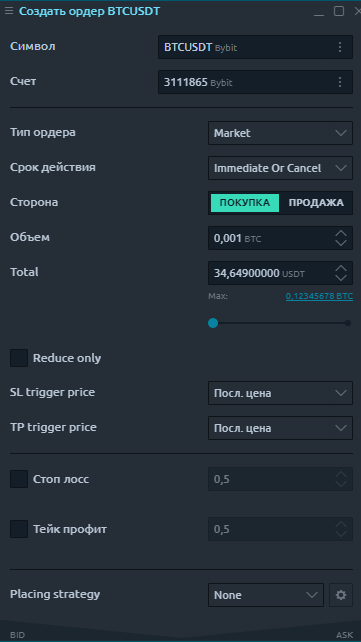
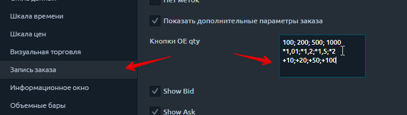

# Ввод ордера для Bybit

> **Bybit -** биржа для торговли бессрочными  деривативныи контрактами на криптовалюты с маржинальным плечом до х100**.** Минимальный контракт от 1$

**Ввод ордеров** на платформе Quantower  можно осуществлять разными вариантами, в зависимости от выбранного стиля торговли:

* _с панели_ [_**Ввода ордера (ОЕ )**_](https://help.quantower.com.ru/trading-panels/order-entry)
* _с панели_ [_**быстрой торговли с графика**_](https://help.quantower.com.ru/analytics-panels/chart/chart-trading)&#x20;
* _торговый режим мышью, визуальная торговля. Быстрое размещения ордеров_ [_**через область графика с помощью мыши**_](https://help.quantower.com.ru/analytics-panels/chart/general-overview#verkhnyaya-panel-instrumentov-grafika)_**.**_
* &#x20;_путем настройки и торговли с_ [_**горячих клавиш.**_ ](https://help.quantower.com.ru/analytics-panels/chart/chart-settings#goryachie-klavishi)

В данной статье покажем:

* [**Как создать ордер Bybit с панели ОЕ (Ввода ордера)**](vvod-ordera-dlya-bybit.md#kak-sozdat-order-bybit-s-paneli-oe-vvoda-ordera)
  * [Общий вид панели ОЕ (Ввода ордера) для биржи Bybit](vvod-ordera-dlya-bybit.md#obshii-vid-paneli-oe-vvoda-ordera-dlya-birzhi-bybit)
  * [Выбор символа и торгового счета; ](vvod-ordera-dlya-bybit.md#vybor-simvola-i-scheta-i-torgovogo-scheta)
  * [Выбор объема ордера ](vvod-ordera-dlya-bybit.md#vybor-obema-ordera)
  * [TP (тейк-профит) и SL стоп лимит (стоп-лосс) ордера](vvod-ordera-dlya-bybit.md#tp-i-sl-ordera-s-paneli-oe-vvod-ordera)\

* [**Как создать ордер Bybit с панели быстрой торговли с графика**](vvod-ordera-dlya-bybit.md#kak-sozdat-order-bybit-s-paneli-bystroi-torgovli-s-grafika)&#x20;
  * [Общий вид панели быстрой торговли с графика для Bybit ](vvod-ordera-dlya-bybit.md#obshii-vid-paneli-bystroi-torgovli-s-grafika-dlya-bybit)
  * [Выбор объема ордера ](vvod-ordera-dlya-bybit.md#vybor-obema-ordera-1)
  * [Кнопки быстрого изменения суммы заказа ](vvod-ordera-dlya-bybit.md#knopki-bystrogo-izmeneniya-summy-zakaza)
  * [TP (тейк-профит) и SL стоп лимит (стоп-лосс) ордера](vvod-ordera-dlya-bybit.md#tp-teik-profit-i-sl-stop-limit-stop-loss-ordera)

## **К**ак создать ордер Bybit с панели ОЕ (Ввода ордера)

Ниже мы рассмотрим как создать ордер на бирже **Bybit** с панели ОЕ (ввода ордера).  Прежде, чем это сделаем, убедитесь что вы успешно [**подключились к бирже Bybit,**](https://help.quantower.com.ru/connections/connection-to-bybit) и выбрали торговую пару с данного соединения.

Панель ОЕ (Ввода ордера) можно открыть, как указано на рисунке ниже:

.png>)

### **Общий вид панели** ОЕ (Ввода ордера) **для биржи Bybit**&#x20;

Панель ввода ордеров позволяет создавать торговые ордера с различными условиями, такими как количество ордеров, цена, сторона, тип ордера, и отправлять их на рынок. На панели ввода заказа вы можете предоставить всю необходимую информацию для заказа и легко отправить ее, нажав соответствующую кнопку действия.

Вся панель условно разделена на несколько зон:

* выбор торгового инструмента и торгового счета;
* установка необходимого количества заказа и стороны заказа (Купить или Продать);
* выбор типа заявки, ее цены и условия TIF;
* установка цен стоп-лосс и тейк-профит;
* информация о текущих ценах Ask и Bid, размере спреда, а также кнопка размещения ордера.

### **Выбор символа и торгового счета;**

Выбор торгового инструмента можно выполнить вручную через Поиск символов или [привязав панель к другим панелям](https://help.quantower.com.ru/general-settings/binds), например, к графику. Просто выберите один цвет ссылки на двух панелях, и у них будет параметр [синхронизированного символа](https://help.quantower.com.ru/general-settings/link-panels).

### **Выбор объема ордера**

Ввести объем ордера можно указав количество в валюте котировки и в процентах от доступной маржи. Сделать это можно, как описано ниже, тремя способами на выбор:

* ввести нужное количество монет/лотов исходя из выбранной торговой пары;
* ввести общую сумму ордера. Это поле крайне удобно, когда нужно быстро указать сумму входа в сделку сразу в валюте баланса, не пересчитывая при этому количество монет по курсу;
* выбрать ползунком сумму ордера в % от общего максимального доступного баланса с учетом установленного кредитного плеча.

### **TP и SL  ордера с панели ОЕ (ввод ордера)**

Биржа Bybit позволяет пользователям еще **до открытия  сделки** (!) просчитать возможные риски и пользователи могут выставить свои цели – **TP** (тейк-профит) и ограничить убытки **SL** ордером (стоп-лосс), одновременно с установкой ордера на вход в  позицию.

Для этого на панели ввода ордера одновременно с установкой ордера, Вы можете сразу задать нужные параметры **TP**  и **SL**&#x20;

.png>)

## Как создать ордер Bybit с панели быстрой торговли с графика

Ниже мы рассмотрим как создать ордер на бирже **Bybit** с панели быстрого ввода ордера с графика. Прежде, чем это сделаем, убедитесь что вы успешно [**подключились к бирже Bybit,**](https://help.quantower.com.ru/connections/connection-to-bybit) и выбрали торговую пару с данного соединения.

Панель инструментов [**быстрой торговли с графика**](https://help.quantower.com.ru/analytics-panels/chart/chart-trading) **Bybit**  можно открыть, как указано на рисунке ниже:

### &#x20;**Общий вид панели быстрой торговли с графика для  Bybit**&#x20;

Общий вид панели ввода заказов для подключения **Bybit** выглядит следующим образом и разделена на следующие категории:

* Выбор счета и символа
* Выбор объема ордера и выбор направления
* Параметры ордера - тип, TIF, цена, алгоритмические настройки.
* Режим для стоп-лосса и тейк-профита.&#x20;
* Параметры размещения ордера (стратегия)

### **Выбор объема ордера**

Выбрать объем ордера можно указав количество в валюте котировки и в процентах от доступной маржи. Сделать это можно, как описано ниже , на Ваш выбор, в зависимости от типа и стиля торговли.:

* ввести нужное количество монет/лотов исходя из выбранной торговой пары;
* кнопками быстрого изменения суммы заказа;
* ввести общую сумму ордера. Это поле крайне удобно, когда нужно быстро указать сумму входа в сделку сразу в валюте баланса, не пересчитывая при этому количество монет по курсу;
* выбрать ползунком сумму ордера в % от общего максимального доступного баланса с учетом установленного кредитного плеча.

### **Кнопки быстрого изменения суммы заказа**

Кнопки быстрого изменения суммы заказа помогут в один клик изменить указанный объем исходя из Вашей стратегии торговли. Вы можете установить по умолчанию любые параметры, которые Вам необходимы для быстрого изменения значений. Причем, кнопки могут изменять не только на заданный объем позиции, но и применять свои любые (!!!) формулы для расчета объема ордера.  Для установки персональных значений для быстрого изменения ордера, необходимо перейти в настройки графика в раздел меню [**"Запись заказа"**](https://help.quantower.com.ru/analytics-panels/chart/chart-settings#vvod-ordera) и найти поле "кнопки OE"

Вы можете установить стандартные значения суммы ордера, которые  соответствует вашим рискам. Это очень удобно для ручной торговли.

### Параметры ордера - тип, TIF

**Праметры Time-in-Force (TIF)** определяют продолжительность времени, в течение которого ордер будет продолжать работать, прежде чем он будет отменен. **Bybit** предоставляет различные TIF:

* GTC (Годен до отмены) - ордера будут работать до тех пор, пока они не будут отменены трейдером или не истечет срок действия контракта;
* FOK (или Fill or Kill) - ордер будет отменен, если он не будет исполнен в полном объеме, как только он станет доступен;
* IOC (Немедленно или отменить) - требует, чтобы любая часть ордера, которая не была исполнена, как только она становится доступной на рынке, была отменена;

#### Post-Only&#x20;

При отмеченном параметре «Post-Only », ордер  исполняется не как операция тейкера, и поэтому при его исполнении зарабатывается вознаграждение мейкера. \
Ордер «Post-Only » отменяется автоматически, если его можно исполнить немедленно против существующего на рынке ордера.

### Reduce-Only

Используется для сокращения размера позиции и не увеличивает ее размер.

### **TP (тейк-профит) и SL стоп лимит (стоп-лосс) ордера**&#x20;

&#x20;Биржа Bybit позволяет пользователям еще **до открытия  сделки** (!) просчитать возможные риски и пользователи могут выставить свои цели – **TP** (тейк-профит) и ограничить убытки **SL** ордером (стоп-лосс), одновременно с установкой ордера на вход в  позицию.

Для этого на панели ввода ордера одновременно с установкой ордера, Вы можете сразу задать нужные параметры **TP**  и **SL**&#x20;

После размещения позиции, **TP**  и **SL** можно изменять по ситуации прямо с графика путем перемещения мышкой на новые уровни:

Далее идет большой блок **функций для управления текущей позицией**. Вы можете удалять или ограничивать ордера или стопы. Вы также можете перевернуть свою позицию с помощью одной кнопки или установить без потерь. Это очень функциональные кнопки, не пропустите их.

Более детальные настройки с торговыми примерами и дополнительными условиями в разделе самой биржи ByBit ["исполнение заказа ](https://help.bybit.com/hc/en-us/sections/900000849226-Order-Execution)"
