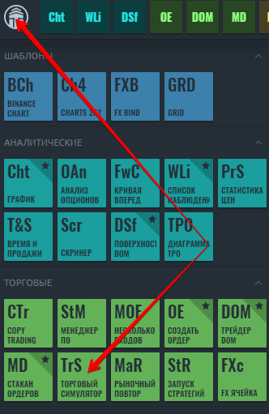
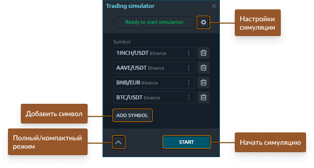
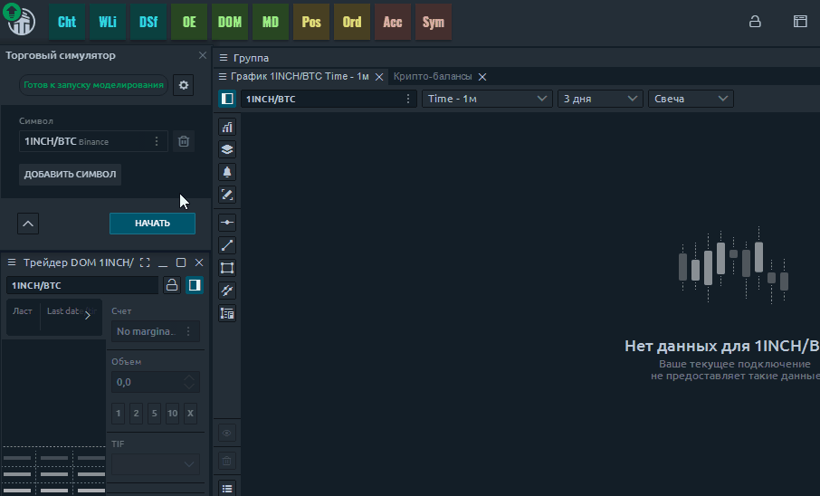
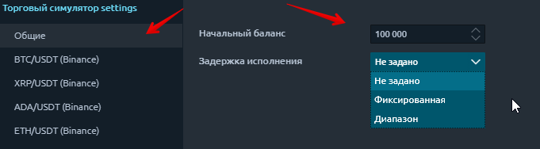

# Симулятор торговли

## Что такое торговый симулятор?

Trading Simulator - это специально разработанный торговый инструмент, позволяющий имитировать исполнение ордеров при любом подключении, в том числе не допускающем торговлю.  
**Как открыть найти и открыть симулятор торговли.** Откройте главное меню, щелкнув логотип, и в разделе **«Торговые»** щелкните значок "Торговый симулятор"

Кому это будет полезно? Для любого трейдера - от новичка до профи, торгующего любым инструментом. Например, криптотрейдеры, у которых нет реальных счетов на криптобирже, могут торговать в демонстрационном режиме на выбранной криптовалютной бирже.

## Как начать симуляцию торговли?

* Запустите **торговый симулятор** из Центра управления. Панель находится в категории Торговля.
* Добавьте желаемые символы, на которых будет происходить симуляция торговли.

  Установите начальный баланс для торговых счетов, задержку исполнения, тип "сетки ордеров"  для выбранных символов и размер комиссии.

* Запустите моделирование, нажав кнопку «**Пуск**». Статус панели изменится на **Моделирование активно.**
* Откройте необходимые панели для анализа и торговли. В заголовке каждой панели, участвующей в симуляции торговли, отображается соответствующая надпись - **Simulator.**


Кнопка **«Стоп»** прервет процесс моделирования, а также отменит все позиции и ордера.


## Общие настройки

В общих настройках вы можете установить начальный баланс для тестового счета, установить задержку исполнения и настроить параметры "сетки ордеров" для каждого инструмента.

* **Начальный баланс** - сумма денег на тестовом счете.


Trading Simulator создает отдельные торговые счета для каждой базовой валюты инструмента. Например, если вы выбрали валютную пару EUR / USD, тогда имя учетной записи будет **Account \(USD\)**, если вы выберете EUR / JPY, тогда имя будет **Account \(JPY\)** соответственно.


* **Задержка исполнения** - промежуток времени между принятием заказа и его исполнением. На реальном рынке этот параметр влияет на проскальзывание. Есть 3 варианта задержки: "Диапазон", "Фиксированная" и "не задано" \(мгновенное исполнение\).

* **Тип сетки** - методы, с помощью которых суммируются существующие и новые позиции. Существует 3 типа сетки: **одна позиция, несколько с каждой стороны, несколько позиций.** Примеры использования каждого метода вы можете найти в описании настроек[ панели History Player.](https://help.quantower.com/trading-panels/history-player#general-and-instruments-settings)

