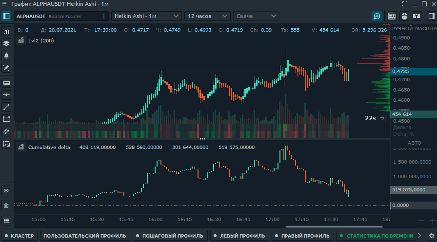
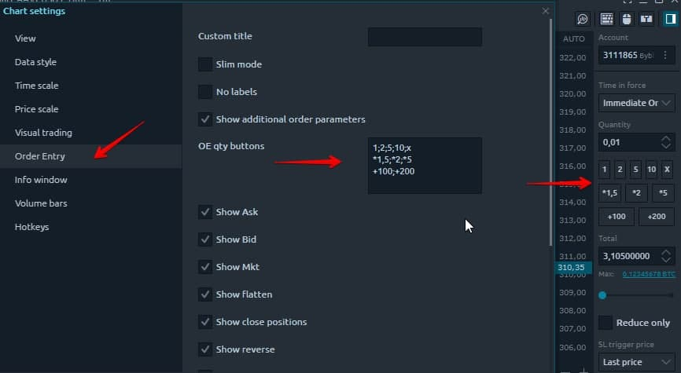
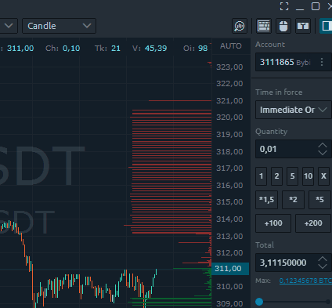
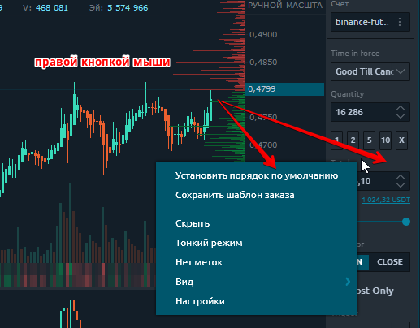

# Визуальный трейдинг

**Торговля с графика** на платформе Quantower  может производиться разными способами, в зависимости от выбранного стиля торговли. 

**Панель быстрой торговли с графика**

* **Как открыть панель быстрой торговли с графика**
* **Как настроить свои кнопки быстрой смены суммы заказа**
* **Настройка объема ордера по умолчанию**
* **Ползунок для ввода объема позиции в долларах**
* **Как установить прибыль и стоп-ордера**
* **Как установить несколько ордеров Take Profit и Stop Loss на одну позицию**
* **Набор кнопок для быстрого заказа и управления позицией**

**Быстрый ввод заказа с лучшими ценами Bid и Offer \(Ask\)**

* **Как открыть Быстрый ввод заказа**
* **Как установить количество объема**

**Визуальный трейдинг мышью**

* **Режим торговли на графике с помощью мыши**
* **Быстрое размещение ордеров на графике с помощью мыши.**
* **Как установить много лимитных ордеров**

**Торговля горячими клавишами**

* **Как активировать торговлю горячими клавишами**
* **Настройка и торговля с помощью горячих клавиш.**

## **Панель быстрой торговли с графика**

### Как открыть панель быстрой торговли с графика

Чтобы получить доступ к панели инструментов быстрой торговли, нажмите кнопку в правом верхнем углу. Если вы не видите эту кнопку, включите ее в настройках

### Как настроить свои кнопки быстрой смены суммы заказа

      Кнопки быстрого изменения суммы ордера помогут вам изменить указанный объем одним щелчком мыши в зависимости от вашей торговой стратегии. Данная настройка больше необходима при торговле лотами, так как именно эти значения могут быстро менять размер позиции.   
    Вы можете установить по умолчанию любые параметры, которые вам нужны для быстрого изменения значений. Причем с помощью кнопок можно изменять не только заданный объем позиции, но и применять любые \(!!!\) формулы для расчета объема ордера. Чтобы установить свои личные значения для быстрой смены заказа, вам необходимо перейти в настройки графика в разделе меню «Ввод заказа» и найти поле «Кнопки OE».

Вы можете установить стандартные значения суммы ордера, которые соответствует вашим рискам. Это очень удобно для ручной торговли.


Кнопки могут изменять не только на заданный объем позиции, но и применять любые формулы


### Настройка **объема ордера** по умолчанию

Щелкнув правой кнопкой мыши, вы можете сохранить настройки ввода ордеров по умолчанию для всех символов.

### **Ползунок для ввода объема позиции в долларах**

**Есть два способа ввести количество позиции:**

-Ввод ордера лотами на торгуемый символ или монету - это было описано выше**.  
-**Ввод суммы денег, запланированной для покупки этого актива. 


Важно помнить, что если вы используете маржинальную торговлю, результат рассчитывается с учетом кредитного плеча.


