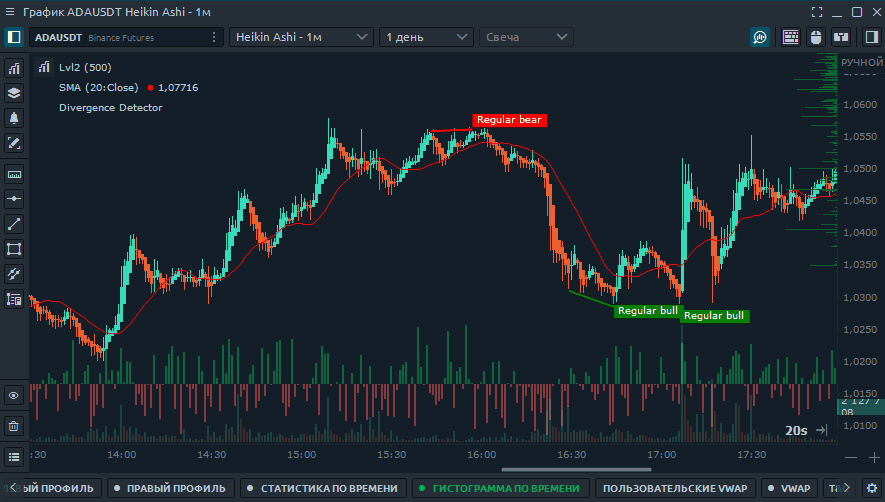

# Торговля с графика

**Торговля с графика** на платформе Quantower  может производиться разными способами, в зависимости от выбранного стиля торговли. 

**Панель быстрой торговли с графика**

* **Как открыть панель быстрой торговли с графика**
* **Как настроить свои кнопки быстрой смены суммы заказа**
* **Настройка объема ордера по умолчанию**
* **Ползунок для ввода объема позиции в долларах**
* **Как установить прибыль и стоп-ордера**
* **Как установить несколько ордеров Take Profit и Stop Loss на одну позицию**
* **Набор кнопок для быстрого заказа и управления позицией**

**Быстрый ввод заказа с лучшими ценами Bid и Offer \(Ask\)**

* **Как открыть "Быстрый ввод заказа"**
* **Как установить количество объема**

**Визуальный трейдинг мышью**

* **Режим торговли на графике с помощью мыши**
* **Быстрое размещение ордеров на графике с помощью мыши.**
* **Как быстро установить сетку ордеров с "шагом объема" \(К\) с помощью мыши**

**Торговля горячими клавишами**

* **Как активировать торговлю горячими клавишами**
* **Настройка и торговля с помощью горячих клавиш.**

## **Панель быстрой торговли с графика**

### Как открыть панель быстрой торговли с графика

Чтобы получить доступ к панели инструментов быстрой торговли, нажмите кнопку в правом верхнем углу. Если вы не видите эту кнопку, включите ее в настройках

### Как настроить свои кнопки быстрой смены суммы заказа

      Кнопки быстрого изменения суммы ордера помогут вам изменить указанный объем одним щелчком мыши в зависимости от вашей торговой стратегии. Данная настройка больше необходима при торговле лотами, так как именно эти значения могут быстро менять размер позиции.   
    Вы можете установить по умолчанию любые параметры, которые вам нужны для быстрого изменения значений. Причем с помощью кнопок можно изменять не только заданный объем позиции, но и применять любые \(!!!\) формулы для расчета объема ордера. Чтобы установить свои личные значения для быстрой смены заказа, вам необходимо перейти в настройки графика в разделе меню «Ввод заказа» и найти поле «Кнопки OE».

Вы можете установить стандартные значения суммы ордера, которые соответствует вашим рискам. Это очень удобно для ручной торговли.


Кнопки могут изменять не только на заданный объем позиции, но и применять любые формулы


### Настройка **объема ордера** по умолчанию

Щелкнув правой кнопкой мыши, вы можете сохранить настройки ввода ордеров по умолчанию для всех символов. Так же можно изменить сохранить свой шаблон заказа для сохранения всех настроек в будущем.

### **Ползунок для ввода объема позиции в долларах**

**Есть два способа ввести количество позиции:**

-Ввод ордера лотами на торгуемый символ или монету - это было описано выше**.  
-**Ввод суммы денег, запланированной для покупки этого актива. 


Важно помнить, что если вы используете маржинальную торговлю, результат рассчитывается с учетом кредитного плеча.


Вы можете ввести в поле или общую сумму в эквиваленте или ползунком выбрать необходимую сумму. Максимально допустимая сумма указывается с учетом кредитного плеча.

### Как установить прибыль и стоп-ордера

Вы можете установить автоматический стоп-лосс и прибыль в пунктах. Установить размер лота/позиции/ордера и защитить свои позиции один из самых важных моментов в трейдинге. Укажите свои значения в соответствующих полях.


Некоторые брокеры, такие как Binance, не разрешают стоп-приказы для лимитных приказов. \(Пока позиция НЕ открыта\) В этом случае используйте лимитные ордера противоположного направления.


* Используйте панель торговли с графика
* Установите свои значения для стоп-лосса или прибыли. Вы также можете использовать только один параметр.
* Используйте кнопку, чтобы активировать сделку с помощью мыши, чтобы установить лимитный ордер.

### Как установить несколько ордеров Take Profit и Stop Loss на одну позицию


Этот пример предназначен для подключения CQG / AMP, так как не все подключения предоставляют по API такую возможность


Чтобы установить несколько стоп-приказов для одной позиции, выполните следующие действия:

* Переключите настройки скобки \(стопа\) в мультирежим
* Введите данные для установки первых лимитных ордеров и сколько лотов или монет нужно закрыть
* Для следующих стоп приказов введите аналогичные данные в следующей строке.
* Вы можете устанавливать заказы, кратные вашему общему объему.

### Набор кнопок для быстрого заказа и управления позицией

Далее идет блок кнопок для быстрого размещения заказа  по соответствующей цене и большой блок функций для управления текущей позицией. Вы можете удалять или ограничивать ордера или стопы. Вы также можете перевернуть свою позицию с помощью одной кнопки или установить без потерь. Это очень функциональные кнопки, не пропустите их.

## **Быстрый ввод заказа с лучшими ценами Bid и Offer \(Ask\)**

### **Как открыть "Быстрый ввод заказа с лучшими ценами"**

Для того что бы открыть **Быстрый ввод заказа с лучшими ценами Bid и Offer \(Ask\)** , нажмите кнопку в правом верхнем углу графика. 

Отображение этой кнопки быстрого вызова на графике можно включать и выключать, отключив верхнюю панель инструментов. Поэтому, если Вы ее не видите, то возможно у Вас отключена она в [**настройках графика**](https://help.quantower.com/analytics-panels/chart/chart-settings). 


Обратите внимание, что для совершения сделки из панели ввода Быстрого ордера необходимо ввести объем лота. И этот объем не совпадает \(!\) с панелью быстрой торговли.


![&#x414;&#x43B;&#x44F; &#x441;&#x43E;&#x432;&#x435;&#x440;&#x448;&#x435;&#x43D;&#x438;&#x44F; &#x441;&#x434;&#x435;&#x43B;&#x43A;&#x438; &#x438;&#x437; &#x43F;&#x430;&#x43D;&#x435;&#x43B;&#x438; &#x432;&#x432;&#x43E;&#x434;&#x430; &#x411;&#x44B;&#x441;&#x442;&#x440;&#x43E;&#x433;&#x43E; &#x43E;&#x440;&#x434;&#x435;&#x440;&#x430; &#x43D;&#x435;&#x43E;&#x431;&#x445;&#x43E;&#x434;&#x438;&#x43C;&#x43E; &#x432;&#x432;&#x435;&#x441;&#x442;&#x438; &#x43E;&#x431;&#x44A;&#x435;&#x43C; &#x43B;&#x43E;&#x442;&#x430;](../.gitbook/assets/bystryi-vvod-kolichestvo.gif)

## Торговля мышью

### Режим торговли на графике с помощью мыши

Режим торговли мышью позволяет устанавливать лимитные и стоп-лимитные ордера прямо на графике. Чтобы активировать эту функцию, нажмите кнопку в правом верхнем углу панели с изображением значка мыши.

**Если позиция мыши выше текущей цены, то** 

* щелчок правой кнопкой мыши установит лимитный ордер
* левый щелчок мыши установит рыночный стоп-ордер на покупку

**Если положение курсора мыши ниже текущей цены, то**

* щелчок правой кнопкой мыши установит Sell stop market
* щелчок правой кнопкой мыши установит лимитный ордер Buy

### **Быстрое размещение ордеров на графике с помощью мыши.**

Чтобы разместить мышью ордер на графике или несколько заказов подряд, установите на панели ордеров необходимое количество и объем одной позиции, **включите режим торговли мышью, и** удерживая CTRL кликом на графике разместите ордер. Таким образом быстро можно разместить один ордер или несколько ордеров с одинаковым объемом.

### **Как быстро установить сетку ордеров с "шагом объема" с помощью мыши**

В некоторых стратегиях торговли необходимо устанавливать несколько ордеров с определенным "шагом объема". Часто в трейдинге применяется так же сеточная торговля. Для этого есть отдельная панель "[**Ввод мульти-ордеров**](https://help.quantower.com.ru/trading-panels/multiple-order-entry)" , но с этой задачей прекрасно можно справится с помощью режима торговли мышью. Все зависит от целей и необходимого результата.

На следующем примере покажем, как быстро установить сетку ордеров на графике с помощью мыши, например с К 1,2 \(каждый последующий ордер будет автоматически пересчитан с шагом +20% к предыдущему ордеру\)

1. Для этого в настройках графика установите режим торговли мышью "**мульти ордера**":

Этот режим позволяет не зажимая CTRL, находиться постоянно в готовности установки ордера. При этом, не мешает мышью устанавливать нужный К

2. Вторым шагом приготовим кнопку  **\[  \* 1,2   \]**  для быстрого изменения "шага объема". Как их настраивать мы описывали [**выше**](https://help.quantower.com.ru/trading-panels/vizualnyi-treiding#kak-nastroit-svoi-knopki-bystroi-smeny-summy-zakaza) в данной статье.

3. На панели торговли с графика установим количество/объем для первого ордера. 

Все готово для быстрого трейдинга с графика мышью и расстановки ордеров с нужным нам шагом объема.

